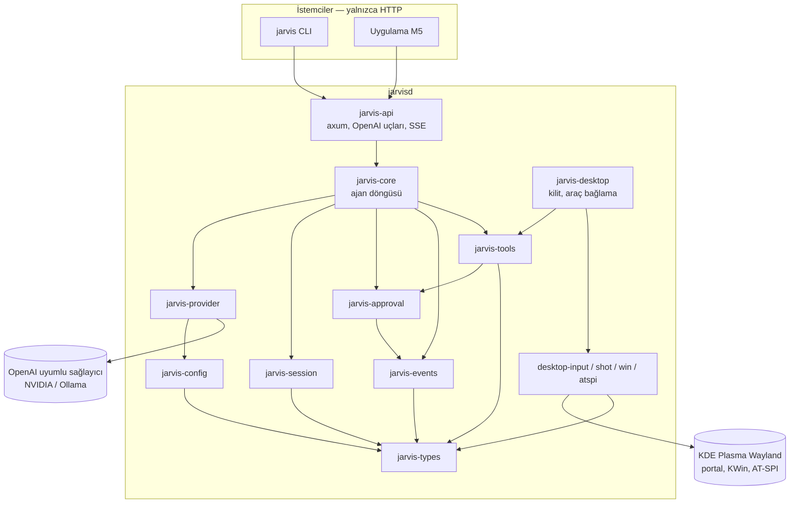
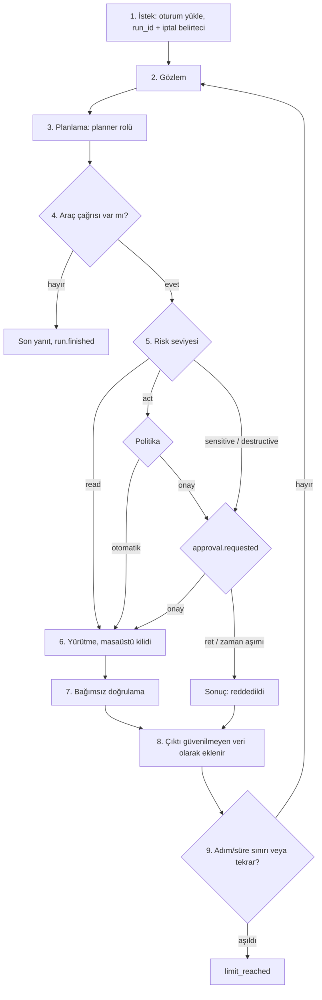
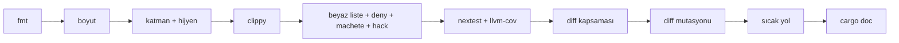
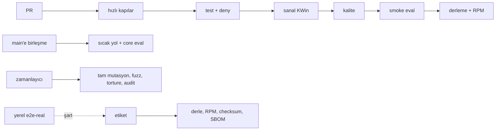
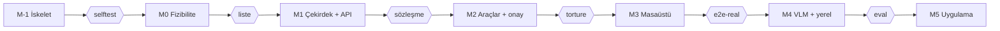

# Jarvis — Mimari Belgesi v0.1

2026-10-09 · Yasin Akmaz

> Bu belge projenin tek doğruluk kaynağıdır. Kararlar `docs/adr/` altında, özellik
> tasarımları `docs/design/` altında, M0 doğrulama sonuçları `docs/m0/checklist.md`
> içinde tutulur. Belge ile kod çelişirse belge önce güncellenir.

## 1. Amaç, kapsam ve değişmez kurallar

Jarvis, KDE Plasma Wayland masaüstünde süreç çalıştırabilen ve fare/klavye ile bilgisayar
kullanabilen tek bir Rust servisidir (`jarvisd`). Servis OpenAI uyumlu bir HTTP API sunar;
uygulama bu API'nin istemcisi olarak sonra gelir.

### Amaç

- Metin komutunu alıp masaüstünde gerçek iş yapan, ne yaptığını gözlemleyip doğrulayan bir ajan.
- Sağlayıcıdan bağımsız model katmanı: bugün barındırılan modeller (build.nvidia.com), yarın
  yerel (Ollama/llama.cpp); geçiş yalnızca `base_url` değişikliği.
- Yapay zekanın yazdığı kodun mekanik kapılarla denetlendiği, küçük dosyalı ve modüler bir kod tabanı.

### Kapsam (v1)

- `jarvisd` daemon'u, HTTP API, olay akışı (SSE), oturumlar, onay akışı, acil durdurma.
- Sistem araçları: süreç, dosya, kabuk komutu (risk seviyeli).
- KDE Wayland masaüstü katmanı: girdi, ekran görüntüsü, pencere, AT-SPI.
- Terminal istemcisi (`jarvis`): olayları gösterir, onayları alır.
- CI/CD, RPM paketi, systemd kullanıcı servisi.

### Kapsam dışı (v1)

- Konuşma tanıma ve sesli çıkış (mevcut dikte uygulamaları kullanılır).
- Grafik uygulama (M5), Android kontrolü, çok kullanıcılı kullanım.
- `uinput`/`ydotool` ve `fake_input` ile girdi enjeksiyonu.
- Otomatik güncelleme.

### Çalışma ortamı

| Öğe | Değer |
| --- | --- |
| İşletim sistemi | Fedora 44, KDE Plasma 6.7.5, Wayland |
| İşlemci / bellek | Intel i3-10100F, 16 GB RAM |
| Ekran kartı | GTX 1650, 4 GB (yaklaşık 2,9 GB boş) |
| Klavye / yerel ayar | Türkçe Q, `tr_TR` |
| Geliştirici | Tek kişi (Yasin) |
| Kaynak kodu | GitHub; depo gizliliği henüz doğrulanmadı, özel varsayılıyor |
| Dil ve araç zinciri | Rust, sabitlenmiş toolchain (`rust-toolchain.toml`: 1.97.0), edition 2024 |

### Değişmez kurallar

1. Mimari bu belgede tamamlanmadan kod yazılmaz; kod, kullanıcı "başla" dediğinde başlar.
2. Model erişimi her zaman OpenAI API uyumludur; yerel geçiş yalnızca yapılandırmadır.
3. Tek daemon, tek API. Uygulama ve terminal istemcisi ince istemcidir, ajan mantığı sunucuda yaşar.
4. Sessiz geri dönüş (fallback) yoktur. Reddedilen portal onayı ya da bozulan oturumda görev
   durur ve uygulamaya olay gönderilir.
5. Araç çıktısı güvenilmeyen veridir; talimat olarak yorumlanmaz.
6. Yıkıcı ve hassas eylemler onaysız çalışmaz. Onaylar yalnızca uygulamada (veya terminal
   istemcisinde) görünür, KDE bildirimi gönderilmez.
7. Dönüş kodu (`rc=0`) kanıt değildir. Başarı, bağımsız bir gözlemciyle doğrulanır.
8. Kalite kapıları (Bölüm 9) geçmeden hiçbir iş bitmiş sayılmaz; AI kapı yapılandırmasını değiştiremez.
9. Sistem istemleri İngilizce, kullanıcı girdisi Türkçedir.

## 2. Sistem genel bakışı

Tüm iş tek `jarvisd` sürecinde çalışır. Sınırlar süreçler arasında değil crate'ler arasındadır
ve bağımlılık yönü yalnızca aşağı doğrudur: API çekirdeğe, çekirdek araçlara ve sağlayıcıya,
araçlar tiplere bağlanır. Rust'ta bir crate başka bir crate'in dahili öğelerine erişemediği
için bu yön derleyiciyle zorlanır; ayrıca `architecture.toml` ve `xtask` onu `cargo metadata`
üzerinden denetler.

İstemciler yalnızca HTTP ile konuşur. Masaüstü crate'leri çekirdeğe doğrudan değil, araç olarak
kayıtlanır; `jarvisd` ikilisi hepsini birleştirir.

### Crate haritası

| Crate | Sorumluluk | Bağlanabileceği crate'ler |
| --- | --- | --- |
| `jarvis-types` | Saf veri tipleri, kimlikler, hata tipleri | hiçbiri |
| `jarvis-config` | TOML şeması, yükleme, doğrulama | types |
| `jarvis-events` | Olay veriyolu (yayın/abone), SSE kaynağı | types |
| `jarvis-provider` | OpenAI uyumlu istemci (`async-openai`), rol yönlendirme, hız sınırı, geri çekilme | types, config |
| `jarvis-session` | Oturum ve mesaj depolama (SQLite), migrasyon | types |
| `jarvis-approval` | Risk sınıflandırma, onay kuyruğu, zaman aşımı | types, events |
| `jarvis-tools` | Araç arayüzü (trait), kayıt defteri, sistem araçları (süreç, dosya, kabuk) | types, approval |
| `jarvis-desktop-input` | Girdi arka ucu trait'i; portal + libei (`reis`); yalnızca testte KWin EIS | types |
| `jarvis-desktop-shot` | ScreenShot2, portal ve Spectacle yedeği | types |
| `jarvis-desktop-win` | KWin scripting ile pencere listesi ve etkinleştirme | types |
| `jarvis-desktop-atspi` | AT-SPI okuma, eylemler, koordinat düzeltme | types, desktop-win |
| `jarvis-desktop` | Masaüstü parçalarını araçlara bağlar, masaüstü kilidi (lease) | desktop-\*, tools |
| `jarvis-core` | Ajan döngüsü, planlama, doğrulama, iptal | provider, session, approval, events, tools |
| `jarvis-api` | `axum`, OpenAI uyumlu uçlar, kimlik doğrulama, SSE | core, types |
| `jarvisd` | İkili: bağlama, systemd bildirimi, yapılandırma | api ve gerekli tüm crate'ler |
| `jarvis-cli` (ikili: `jarvis`) | Terminal istemcisi, yalnızca HTTP istemcisi | types |
| `jarvis-fixture` | Test uygulaması (üretim paketine girmez) | yok |
| `xtask` | Kalite kapıları ve sürüm komutları | yok |

Makine tarafından okunan karşılığı: `architecture.toml`.

### Yasak bağımlılıklar

- `jarvis-types` hiçbir iç crate'e bağlanamaz.
- `jarvis-core`, `axum` veya herhangi bir HTTP crate'ine bağlanamaz.
- `jarvis-api`, `jarvis-desktop-*` crate'lerine doğrudan bağlanamaz.
- `jarvis` (cli), `jarvis-core`'a bağlanamaz; yalnızca HTTP üzerinden konuşur.
- `jarvis-fixture` ve `xtask` üretim ikililerine girmez.

### Temel dış bağımlılıklar

`tokio`, `axum`, `async-openai`, `zbus`, `reis`, `xkbcommon`, `atspi`, `serde`, `tracing`,
`rmcp` (isteğe bağlı `/mcp` ucu). Her yeni bağımlılık crates.io'da gerçekten var olup olmadığı,
yaşı ve indirme sayısı açısından doğrulanır (`cargo xtask crate-info`) ve beyaz listeye
(`supply-chain/allowlist.toml`) bir ADR ile eklenir (Bölüm 9).

## 3. Çalışma zamanı

`jarvisd`, API'yi, ajan görevlerini ve olay veriyolunu tek bir `tokio` çalışma zamanında
çalıştırır. Her kullanıcı isteği bir koşu (run) olur; koşu iptal edilebilir ve her adımı olay
olarak yayınlanır.

Reddedilen eylem ajana "reddedildi" sonucu olarak döner. Sınır aşılmadıysa döngü gözleme geri sarılır.

### Süreç yaşam döngüsü

1. `systemd --user` hizmeti, `Type=notify`; sabit ikili yolu `/usr/bin/jarvisd`.
2. Başlangıç sırası: yapılandırmayı doğrula, veritabanı yedekle ve migrasyonu çalıştır,
   sağlayıcıları kaydet, masaüstü arka uçlarını yokla, API'yi `127.0.0.1`'e bağla, hazır
   olduğunu bildir.
3. D-Bus bağlantısı süreç ömrü boyunca açık kalır; portal oturumu bağlantıyla birlikte ölür.
4. `SIGTERM`: çalışan koşular iptal edilir, masaüstü kilidi bırakılır, denetim kaydı yazılır.

### Ajan döngüsü (algoritma)

1. İstek gelir. Oturum yüklenir (`x-jarvis-session`) ya da geçici oturum açılır; `run_id` ve
   iptal belirteci oluşturulur.
2. Gözlem: gerektiğinde sistem durumu, ekran görüntüsü ve AT-SPI ağacı toplanır.
3. Planlama: `planner` rolü, mesajlar ve araç şemalarıyla çağrılır. Yanıt ya metindir ya da
   araç çağrıları.
4. Araç çağrısı yoksa son yanıt döner ve koşu biter.
5. Her araç çağrısı için risk seviyesi belirlenir. `read` doğrudan çalışır; `act` politikaya
   bakar; `sensitive` ve `destructive` onay bekler (`approval.requested` olayı). Reddedilirse
   araç sonucu "reddedildi" olarak ajana döner.
6. Yürütme: araç çalıştırılır. Masaüstü araçları önce kilidi (lease) alır.
7. Doğrulama: aracın bağımsız gözlemcisi sonucu kontrol eder (pencere başlığı değişti mi,
   dosya var mı). Sonuç `doğrulandı`, `doğrulanamadı` veya `başarısız` olur.
8. Araç çıktısı güvenilmeyen veri olarak işaretlenip mesajlara eklenir.
9. Döngü denetimleri: adım sınırı, süre sınırı, tekrar tespiti (aynı eylem + aynı sonuç).
   Aşılırsa koşu `limit_reached` ile durur.
10. 3. adıma dön.

Sayısal sınırlar yapılandırılabilir olur; varsayılanlar M1'de ölçülerek belirlenir.

### Hata ve iptal davranışı

| Durum | Davranış |
| --- | --- |
| Sağlayıcı 429 | Üstel geri çekilme (üst sınır + jitter), `run.step` olayıyla bildirilir |
| Portal onayı reddedildi veya oturum bozuldu | Görev durur, `desktop.unavailable` olayı uygulamaya gider; başka arka uca geçilmez |
| İptal veya `POST /halt` | İptal belirteci her bekleme noktasında denetlenir; araç yarım kalmışsa durum `doğrulanamadı` yazılır |
| Araç başarısız | Hata ajana veri olarak döner; aynı hata tekrarlanırsa döngü tespiti devreye girer |

### Olay veriyolu

Tüm olaylar `/events` (SSE) üzerinden yayınlanır ve denetim kaydına yazılır. Her olay `run_id`,
`trace_id` ve zaman damgası taşır.

| Olay | Ne zaman |
| --- | --- |
| `run.started` / `run.finished` / `run.failed` | Koşu sınırları |
| `run.step` | Her planlama/yürütme adımı |
| `tool.requested` / `tool.completed` | Araç çağrısı öncesi/sonrası |
| `approval.requested` / `approval.resolved` | Onay isteği ve sonucu |
| `desktop.unavailable` | Portal reddi veya bozuk oturum |
| `halt` | Acil durdurma |

### Masaüstü kilidi (lease)

Gerçek imleç hareket ettiği için masaüstü girdisi tek yazarlıdır. Bir koşu kilidi alır; diğer
koşular bekler ya da reddedilir. Kilit, koşu bitince, iptalde ve `halt`'ta bırakılır.

### Acil durdurma

`POST /halt` tüm koşuları iptal eder, masaüstü kilidini bırakır, kuyruktaki girdi eylemlerini
boşaltır ve `halt` olayı yayınlar. KDE global kısayolu M3'te denenecek; çalışıp çalışmayacağı
doğrulanmamıştır.

## 4. API yüzeyi

API yalnızca `127.0.0.1` üzerinde dinler ve `/v1` altında OpenAI sözleşmesini izler; Jarvis'e
özgü uçlar `/v1` dışında, ayrı bir ad alanındadır.

| Uç nokta | Amaç |
| --- | --- |
| `POST /v1/chat/completions` | `model: "jarvis"` sunucu tarafı ajan döngüsünü çalıştırır. `"planner"`, `"vision"`, `"fast"` ise yapılandırılmış sağlayıcıya yönlendirme (passthrough). Akış (`stream`) desteklenir. |
| `GET /v1/models` | Kullanılabilir model/rol adları |
| `GET /events` | Olay akışı (SSE) |
| `GET /approvals` | Bekleyen onay istekleri |
| `POST /approvals/{id}` | Onay veya ret kararı |
| `GET /sessions`, `GET /sessions/{id}`, `DELETE /sessions/{id}` | Oturum yönetimi |
| `GET /tools` | Araç envanteri ve şemaları |
| `GET /providers` | Rol-sağlayıcı bağları ve durumları (anahtar dönmez) |
| `POST /halt` | Acil durdurma |
| `GET /healthz`, `GET /readyz` | Hizmet sağlığı ve hazırlığı |
| `/mcp` | İsteğe bağlı, `rmcp` ile MCP uç noktası |

### Kimlik doğrulama

- Tüm çağrılar `Authorization: Bearer <token>` ister.
- Token ilk başlatılmada üretilir ve `0600` izinli bir dosyada tutulur.
- Dinleme adresi yalnızca loopback; `0.0.0.0` yapılandırmada reddedilir.

### Oturumlar

- Oturum, `x-jarvis-session` başlığıyla seçilir. Başlık yoksa oturum geçicidir ve saklanmaz.
- Mesaj geçmişi sunucuda tutulur; istemci her seferinde tüm geçmişi göndermek zorunda değildir.

### Hata biçimi

Hatalar OpenAI biçimindedir: `{"error": {"message", "type", "param", "code"}}`. Jarvis'e özgü
kodlar (`approval_denied`, `desktop_unavailable`, `limit_reached`, `halted`) `code` alanında taşınır.

### Sürümleme ve sözleşme denetimi

- `/v1` içinde yalnızca ekleyici değişiklik yapılır. Kırıcı değişiklik `/v2` olur.
- OpenAPI belgesi koddan üretilip depoya girer (`openapi.json`). Bir değişiklik bu dosyada
  kırıcı fark yaratırsa kapı kırmızı olur.
- `/tools` çıktısı `insta` ile anı görüntüsü (snapshot) olarak kilitlenir; şema değişikliği
  bilinçli onay gerektirir.
- API'nin OpenAI uyumu, testlerde `async-openai` istemcisinin kendisiyle sınanır (Bölüm 10).

## 5. Sağlayıcılar ve roller

Ajan modele rol adıyla ulaşır (`planner`, `vision`, `fast`); her rol yapılandırmada bir
sağlayıcıya bağlanır. Barındırılan modelden yerel modele geçmek, ilgili sağlayıcının
`base_url` değerini değiştirmektir; kod değişmez.

| Rol | Görev | Gereken yetenek |
| --- | --- | --- |
| `planner` | Plan, araç seçimi, son yanıt | Araç çağrısı (tool calling) |
| `vision` | Ekran görüntüsünden hedef bulma (grounding), AT-SPI boş kaldığında yedek | Görüntü girdisi |
| `fast` | Kısa/ucuz işler: sınıflandırma, özetleme | Hızlı yanıt |

### Sağlayıcı tanımı

Her sağlayıcı şunları taşır: `base_url`, API anahtarının okunacağı ortam değişkeni adı, model
adı, bildirilen yetenekler (araç çağrısı, görüntü, akış), dakikalık istek sınırı. Anahtarlar
yapılandırma dosyasına yazılmaz.

### Kararlar

- İstemci ve tipler `async-openai` ile gelir; `base_url` yapılandırılabilir olduğu için aynı kod
  hem barındırılan hem yerel uçla çalışır.
- Yetenek uyumsuzluğu **başlangıçta** hata verir (ör. `planner` olarak gösterilen modelin araç
  çağrısı desteği yoksa), koşu sırasında sessizce bozulmaz.
- Hız sınırı: sağlayıcı başına kova (token bucket). NVIDIA ücretsiz katmanı yaklaşık
  40 istek/dakika; yalnızca prototip içindir.
- Yeniden denenebilir hatalar (429, 5xx, zaman aşımı) geri çekilmeyle denenir; denenemez
  hatalar (401, 400) hemen döner.
- v1'de otomatik sağlayıcı değiştirme yoktur (öneri): sağlayıcı çökerse koşu açık bir hata
  koduyla biter.
- Sistem istemleri İngilizcedir, depoda sürümlü dosyalar olarak durur ve `agent_version`
  bilgisine dahil edilir.

### Donanım gerçeği

GTX 1650'de yaklaşık 2,9 GB boş VRAM var. Yerel modda bu yüzden: `planner` CPU'da (3–4B
parametre, Q4), `vision` GPU'da küçük bir model (yaklaşık 2B). Bu eşleşme M4'te ölçülecek;
şimdilik barındırılan modeller varsayılan yoldur.

## 6. Araçlar, risk ve güvenlik

Güvenlik sınırı sandbox değil, risk seviyeleri ve onay akışıdır: ajan kullanıcının kendi
hesabıyla, masaüstüne ve ev dizinine erişerek çalıştığı için süreç izolasyonu tek başına
yetmez. Model "onaylandı" demiş olsa bile riskli bir araç yalnızca kullanıcının onayıyla çalışır.

### Araç sözleşmesi

Her araç şunları bildirir: ad ve JSON şeması (`/tools` ile yayınlanır), risk seviyesi (sabit ya
da girdiden hesaplanan), yürütücü, **bağımsız doğrulayıcı** (verifier: sonucu yürütücüden ayrı
bir yoldan gözlemler), zaman aşımı süresi.

### Risk seviyeleri

| Seviye | Örnek | Davranış |
| --- | --- | --- |
| `read` | Dosya okuma, pencere listesi, ekran görüntüsü | Doğrudan çalışır, kaydedilir |
| `act` | Uygulama açma, tıklama, yazma | Politikaya göre; varsayılan politika M2'de netleşir (öneri: otomatik + kayıt) |
| `sensitive` | Parola/ödeme alanına girdi, ağa veri gönderme, sistem ayarı değiştirme | Onay gerekir |
| `destructive` | Dosya silme, paket kaldırma, disk yazma | Onay gerekir, ayrıntılı özetle |

Kabuk komutlarında risk girdiye bağlıdır. Komut ayrıştırılır; tanınmayan veya
ayrıştırılamayan komut `sensitive` altına düşmez (başarısızlıkta kapalı: fail-closed).

### Onay akışı

1. Araç çağrısı `tool.requested` olarak kaydedilir; risk seviyesi onay gerektiriyorsa kuyruğa girer.
2. `approval.requested` olayı yayınlanır: araç adı, tam argümanlar, risk seviyesi, beklenen etki.
3. Uygulama veya terminal istemcisi kararı `POST /approvals/{id}` ile gönderir.
4. Onay, gösterilen argümanların hash'ine bağlıdır; argümanlar sonradan değişirse onay geçersizdir.
5. Zaman aşımı ret sayılır. `approval.resolved` olayı yayınlanır.

Onay yalnızca uygulamada ya da terminal istemcisinde görünür; KDE bildirimi gönderilmez.

### Tehdit modeli

| Tehdit | Önlem |
| --- | --- |
| Prompt injection (araç çıktısı, web sayfası, dosya içeriği) | Çıktı güvenilmeyen veri bölümünde taşınır, talimat sayılmaz; riskli araçlar modelin sözüne bakılmaksızın onay ister; torture eval'inde izlenir |
| Yetkisiz API erişimi | Loopback + Bearer token |
| Kaçak döngü | Adım ve süre sınırı, tekrar tespiti, `POST /halt` |
| Gizli anahtar sızıntısı | Anahtarlar yapılandırmada değil ortam değişkeninde; günlük ve olaylarda maskelenir; kasetlerde başlık süzülür |
| Yanlış pencereye girdi | Pencere etkinleştirme + doğrulama, masaüstü kilidi |
| Onay atlatma | Onay argüman hash'ine bağlı, tek onay yolu uygulama |
| Tedarik zinciri | `cargo-deny`, crate doğrulama (beyaz liste + `crate-info`), SHA'ya sabitli action'lar, otomatik güncelleme yok |

Bu tablo ilk taslaktır; M2 sonunda bir tehdit modeli gözden geçirmesiyle güncellenir.

## 7. KDE Wayland masaüstü katmanı

KDE Wayland'de bilgisayar kullanmak için olgun, hazır bir kütüphane yoktur; bu katmanı `zbus`
üzerinde kendimiz yazıyoruz, `reis`, `xkbcommon` ve `atspi` yardımcı olarak kullanılıyor. Her
yetenek bir trait arkasındadır ve her sonuç hangi arka ucun çalıştığını raporlar.

| Yetenek | Birincil yol | Yedek | Not |
| --- | --- | --- | --- |
| Klavye/fare girdisi | XDG RemoteDesktop portalı (`zbus`) → `ConnectToEIS` → libei (`reis`) | KWin özel EIS arayüzü; varsayılan KAPALI, yalnızca test | Tek seferlik kullanıcı onayı + restore |
| Ekran görüntüsü | KWin `org.kde.KWin.ScreenShot2` | Screenshot portalı, Spectacle | `.desktop` yetkisi gerekir |
| Pencere listesi/etkinleştirme | KWin scripting (D-Bus) | yok | Sonuçlar kendi kayıtlı D-Bus servisimize döner |
| Semantik eylem | AT-SPI (`DoAction`) | VLM ile hedef bulma + koordinat girdisi | Electron/Chromium ağaçları boş olabilir |
| Unicode yedek yazım | Klipper (D-Bus) + Ctrl+V | yok | M0'da doğrulanacak |

Yedek yollar yalnızca açık yapılandırmayla devreye girer. Sessiz geçiş yoktur ve
XTEST/`xdotool`/`uinput`/`ydotool` kullanılmaz (`deny.toml` ilgili crate'leri yasaklar).

### Girdi

- Portal oturumu: `CreateSession`, `SelectDevices` (klavye + fare, `persist_mode=2`, restore
  verisi), `Start`, `ConnectToEIS`.
- Her zaman klavye ve fare birlikte istenir; ekran paylaşımı ve portal panosu istenmez. KDE
  restore'u yalnızca cihaz türleri, ekran paylaşımı ve pano bayrakları birebir aynıysa atlar.
- Tutarlı bir uygulama kimliği gerekir. Portal oturumu D-Bus bağlantısıyla öldüğünden bağlantı
  daemon ömrü boyunca açık kalır.
- libei: el sıkışma tamamlanır ve `ei_pingpong` istekleri yanıtlanır. `ei_connection.sync`
  onayı gelmeden başarı raporlanmaz. Anahtar haritası (keymap) dosya tanımlayıcısı 0. konumdan
  okunur ve `xkbcommon` ile ayrıştırılır.
- Mutlak işaretçi: KWin EIS, çıktı başına bölgeler kullanır; ScreenCast akışı gerekmez.
  (Portal üzerindeki `Notify*` mutlak işaretçi davranışı doğrulanmadı.)
- Odaklanmamış pencereye enjekte edilen tıklamalar düşebilir; pencere önce etkinleştirilir ve
  yaklaşık 250 ms beklenir.

### Türkçe Q

Yazım keysym duyarlıdır: karakter, kullanıcının gerçek keymap'inden (keycode + değiştirici)
bulunur; `ğ ü ş ı ö ç İ` birinci sınıf desteklenir. Haritada olmayan karakter Klipper panosu ve
Ctrl+V ile yazılır; pano geçici olarak değiştiğinden önceki içeriği geri yükleme M0'da denenir.

### Ekran görüntüsü

- `ScreenShot2` yaklaşık 30–70 ms sürer ve ham ARGB32 (premultiplied) veriyi bir boru
  tanımlayıcısıyla verir.
- Yetki: `.desktop` dosyasında `X-KDE-DBUS-Restricted-Interfaces=org.kde.KWin.ScreenShot2`;
  `kbuildsycoca6` çalıştırılır. KWin'in sürecin `/proc/<pid>/exe` yolunu `Exec=` ile eşleştirdiği
  bilgisi tek kaynağa dayanıyor ve doğrulanmadı.
- Başka sanal masaüstündeki pencereler yakalanamaz; pencere önce geçerli masaüstüne getirilir.
- Sanal KWin (`--virtual`) arka ucunda ScreenShot2 veri vermeyebilir (kwin-mcp'nin raporu); bkz. Bölüm 10.

### Pencereler

KWin scripting: betik yüklenir ve çalıştırılır, sonuçlar kendi D-Bus servisimize döner
(kdotool yöntemi). Aynı yol, AT-SPI koordinat düzeltmesi için istemci başlangıç noktasını da verir.

### AT-SPI

- Önce semantik eylem (`DoAction`), olmazsa koordinat.
- KDE Wayland'de AT-SPI SCREEN koordinatları pencere yerelidir; KWin istemci başlangıcıyla
  kaydırılır (PID + pencere başlığıyla eşleştirme; GTK4 için WINDOW koordinatları tercih
  edilir). Kısmi ölçekleme denenmedi.
- Önbelleği olmayan sorgu yaklaşık 0,3–0,4 s sürebilir.
- Qt bağlam menüleri görünmeyebilir; bu durumda VLM yedeği kullanılır.

### Kimlik

Portal onayının kalıcılığı ve ScreenShot2 yetkisi sabit bir ikili yoluna ve `.desktop`
kimliğine bağlıdır. Üretim ve geliştirme ayrı uygulama kimliği, ayrı `.desktop` ve ayrı veri
dizini taşır (Bölüm 11).

## 8. Veri, yapılandırma ve gizli anahtarlar

Kalıcı veri tek bir SQLite dosyasında, yapılandırma TOML'dadır; gizli anahtarlar bunların
hiçbirinde durmaz. Üretim ve geliştirme ayrı dizinler kullanır.

| Veri | Yer (XDG) | Biçim |
| --- | --- | --- |
| Yapılandırma | `~/.config/jarvis/config.toml` | TOML, şema sürümlü |
| Gizli anahtarlar | `~/.config/jarvis/secrets.env` (`0600`) | `EnvironmentFile=` ile systemd'ye verilir |
| Veritabanı | `~/.local/share/jarvis/jarvis.db` | SQLite |
| API token'ı | `~/.config/jarvis/token` (`0600`) | Düz metin |
| Günlükler | journald | JSON (`tracing`) |

Geliştirme sürümü `jarvis-dev` adıyla ayrı dizinlere ve ayrı uygulama kimliğine yazılır.

### Veritabanı

- Tablolar: oturumlar, mesajlar, koşular, onaylar, olaylar/denetim kaydı, notlar.
- Denetim kaydı yalnızca eklemelidir (append-only); her satır `run_id` ve `trace_id` taşır,
  gizli değerler maskelenir.
- Saklama süresi yapılandırılabilir (öneri).
- Sürücü seçimi (`sqlx` ya da `rusqlite`) açık karardır; ölçütler: derleme zamanı sorgu
  denetimi, async uyumu, bağımlılık ağırlığı. Bir ADR ile M1 başında seçilir.

### Migrasyonlar

- Yalnızca ileri yönlü ve sürümlüdür.
- Her migrasyondan önce veritabanı `jarvis.db.bak-<sürüm>` olarak kopyalanır.
- Daemon, kendi sürümünden **daha yeni** bir şema görürse başlamayı reddeder.

### Yapılandırma

- Başlangıçta tam doğrulanır: bilinmeyen alan, uyumsuz sağlayıcı yeteneği, loopback dışı
  dinleme adresi hata verir.
- Şema sürümü uyuşmuyorsa açık bir hata mesajıyla durur.

### Gizli anahtarlar

v1'de `0600` izinli ortam dosyası. Anahtarlar bellek dışında günlüğe, olaya, hata mesajına ya
da koşu kayıtlarına yazılmaz. Secret Service / KWallet entegrasyonu uygulama aşamasına
bırakıldı. CI'da NVIDIA anahtarı yalnızca `main` ve gece işlerinin görebildiği korumalı bir
ortamda durur.

## 9. Kod kalitesi kapı sistemi

Yapay zekaya "iyi yaz" demek işe yaramaz; kararlarımız kötü kodun derlenmesini, commit
edilmesini ve "bitti" sayılmasını mekanik olarak imkansız kılmak üzerine kurulu. Altı katman
vardır ve hepsi tek komuta bağlanır: `cargo xtask verify`. Bu komut geçmeden hiçbir iş bitmiş
sayılmaz. Uygulama ayrıntıları: ADR 0021, `docs/design/0001-m-1-iskelet.md`.

| Katman | Ne yapar | Nasıl zorlanır |
| --- | --- | --- |
| 1. Derleyici ve lint | Uyarı kalmaz, `unsafe` yok, `unwrap`/`panic` yok | `[workspace.lints]`, `clippy.toml`, `-D warnings` |
| 2. Boyut | Dosya ve fonksiyon küçük kalır | `xtask` dosya satır kontrolü + Clippy |
| 3. Mimari | Katman yönü korunur | Crate sınırları + `architecture.toml` denetimi |
| 4. Doğrulama | Testler var, gerçekten bir şey ölçer | nextest, kapsama, mutasyon testi, `cargo-deny`, crate doğrulama |
| 5. Süreç | Önce tasarım, sonra test, sonra kod | Tasarım belgesi + hook'lar + insan onayı |
| 6. Performans | Sıcak yollarda gerileme olmaz | Komut sayısı tabanlı karşılaştırma |

### Katman 1: derleyici ve lint

- Tek `[workspace.lints]` tablosu; her crate `lints.workspace = true` ile miras alır. Tablo
  `xtask/src/baseline/workspace.toml` ile birebir aynı olmalıdır.
- Kendi crate'lerimizde `unsafe_code = "forbid"` (`deny` değil: `forbid` altta gevşetilemez).
- Clippy: `pedantic` ve `nursery` uyarı olarak açık, `verify`'da hata. `restriction` grubunun
  **tamamı** açılmaz; seçilmiş liste açılır: `unwrap_used`, `expect_used`, `panic`, `todo`,
  `unimplemented`, `dbg_macro`, `print_stdout`, `indexing_slicing`, `arithmetic_side_effects`,
  `await_holding_lock`, `await_holding_refcell_ref`, `undocumented_unsafe_blocks`; ayrıca
  rustc `missing_docs`.
- `allow_attributes` ve `allow_attributes_without_reason` yasaklıdır. AI bir uyarıyı `#[allow]`
  ile susturamaz; gerekirse `#[expect(lint, reason = "...")]` kullanır.
- `clippy.toml` eşikleri başlangıç değerleridir: fonksiyon satırı 60, bilişsel karmaşıklık 15,
  argüman sayısı 6, tip karmaşıklığı 200.
- `rustfmt.toml` (`max_width = 100`), `rust-toolchain.toml` ile sabit toolchain, edition 2024.

### Katman 2: boyut sınırları

| Ne | Sınır | Aşılırsa |
| --- | --- | --- |
| Kaynak dosya (testler hariç) | 300 satır | `verify` kırmızı; hata mesajı "şu modüllere böl" der |
| Fonksiyon | 60 satır | Clippy `too_many_lines` |
| Satır genişliği | 100 sütun | `rustfmt` + `xtask` (dizge/yorum dahil) |
| `mod.rs` | Yalnızca `pub mod`/`pub use` | `xtask` |
| Crate başına dosya | Yaklaşık 15'i geçince bölmeyi düşün | Uyarı |

Kısa istisna: dosya başına `// xtask: allow-long-file: <gerekçe>` yazılabilir; bu satırlar her
`verify` çıktısında listelenir.

### Katman 3: mimari zorlama

Mimari belgede kalmaz, crate sınırı olarak kurulur (Bölüm 2). `architecture.toml` izin verilen
bağımlılık yönlerini tanımlar; `xtask`, `cargo metadata` çıktısıyla karşılaştırır. `cargo-pup`
kullanılmaz.

### Katman 4: doğrulama

Sıra zorunludur:

1. Tasarım belgesi yazılır (Katman 5).
2. Test ve doğrulama betiği kodun **önce** yazılır.
3. `cargo xtask verify --expect-red <test>` testin gerçekten başarısız olduğunu kanıtlar.
4. Kod yazılır, test yeşile döner.
5. Mutasyon testi testin gerçekten bir şey ölçtüğünü kanıtlar.

Kapılar: `cargo nextest`, `proptest`, `insta`; `cargo llvm-cov` ile **değişen satırlarda**
kapsama tabanı %80; `cargo-mutants --in-diff` (tam koşu gecelik); `cargo-deny`,
`cargo-hack --each-feature`, `cargo-machete`, uyarısız `cargo doc`; **crate halüsinasyon
kontrolü**: her doğrudan bağımlılık `supply-chain/allowlist.toml`'da bir ADR'ye bağlı olmalı,
yeni crate `cargo xtask crate-info` ile doğrulanır ve insan onayı ister.

### Katman 5: yapay zekanın çalışma süreci

Her özellik için kod başlamadan üç yazılı parça zorunludur:

1. **Tasarım dosyası** (`docs/design/NNNN-ad.md`): amaç, kapsam dışı, tipler, hata durumları, test planı.
2. **Algoritma ve şema:** Mermaid diyagramı.
3. **ADR** (`docs/adr/`): neden bu kütüphane/yaklaşım, hangi alternatif reddedildi.

Sonra: tasarım yazılır → insan onaylar → test → kod.

`AGENTS.md` / `CLAUDE.md` kısa tutulur (yaklaşık 100 satır).

**Claude Code hook'ları** (`.claude/settings.json`):

- `PostToolUse`: `.rs`/`.toml` yazımından sonra `cargo xtask verify --fast`; çıktı yapay zekaya geri beslenir.
- `PreToolUse` (exit code 2 ile engelleme): kapı yapılandırma dosyalarına yazma engellenir.
- `Stop`: yapay zeka "bitti" demeden önce `cargo xtask verify` çalışır; kırmızıysa durmasına izin verilmez.

Hook davranışlarının (özellikle exit code 2'nin) gerçek Claude Code kurulumunda doğrulanması M0 #12'dir.

### Katman 6: performans

- Release profili: `lto = "thin"`, `codegen-units = 1`, `panic = "abort"`, `strip = "symbols"`, `opt-level = 3`.
- Performans kapısı yalnızca sıcak yollarda (girdi enjeksiyonu gecikmesi, ekran görüntüsü
  işleme, ayrıştırıcılar); Gungraun ile komut sayısı tabanlı, eşik %5. M3'te kurulur; o zamana
  kadar bench hedefi eklemek kapıyı kırmızı yapar.
- Async kuralı: engelleyici çağrı yasaktır; ağır CPU işleri `spawn_blocking`'e gider.

### `xtask verify` sırası

İlk hatada durur. İlk dört adım (`--fast`) PostToolUse hook'unda, tamamı Stop hook'unda ve CI'da çalışır.

### Bu yapının yakalamadığı

Derleyici ve lint mimari ve mantık hatalarını yakalamaz. Bu yüzden insan onaylı tasarım kapısı
(Katman 5) kaldırılamaz.

## 10. Test stratejisi

Test piramidi sekiz seviyedir ve her seviyenin bir **oracle**'ı vardır. Test edilen şeyin kendi
çıktısına güvenen test, test sayılmaz.

| # | Seviye | Neyi test eder | Oracle | Ne zaman |
| --- | --- | --- | --- | --- |
| L0 | Statik kapılar | fmt, clippy, boyut, katman yönü, deny | Araçların kendisi | Her yazımda (hook), her PR |
| L1 | Birim + `proptest` | Risk sınıflandırma, durum makineleri, ayrıştırıcılar | Özellik (property) | Her PR |
| L2 | Bileşen testleri (sahte bağımlılıklar) | Ajan döngüsü, onay, iptal, 429, döngü tespiti | Senaryo betiği | Her PR |
| L3 | Sağlayıcı kaset tekrarı | `jarvis-provider`, gerçek HTTP yanıtlarıyla | Kayıtlı yanıt | Her PR |
| L4 | API sözleşme testleri | OpenAI uyumu, SSE, hata biçimi, `/halt`, `/approvals` | OpenAPI + `async-openai` istemcisi | Her PR |
| L5 | Gerçek sistem testleri | Süreç, dosya, KWin, AT-SPI, klavye/fare | Bağımsız gözlemci | Karma |
| L6 | Ajan değerlendirmeleri (eval) | Gerçek LLM ile görev başarısı, güvenlik | Rubrik + sıfır tolerans | Smoke her PR; core gecelik; torture haftalık |
| L7 | Dağıtım sonrası duman | Kurulu servis ayakta mı | `/healthz`, `/readyz` | Her deploy |

### Sahte bağımlılıklar (L2)

`StubLlm` (deterministik araç çağrıları), `FakeDesktop` (pencere, tıklama, ekran görüntüsü),
`FakeClock` (zaman aşımı ve geri çekilme testleri beklemeden çalışır).

### Kaset tekrarı (L3)

Kayıt tur başına yapılır. CI'da mod "kayıt yok"tur: kaset eksikse build kırılır, gizlice canlı
API'ye gidilmez. `Authorization` başlığı commit'ten önce silinir. Kasetler gözden geçirilen test
artefaktıdır.

### API sözleşme testleri (L4)

`jarvisd` süreç içinde ayağa kaldırılır ve istemci olarak `async-openai`'ın kendisi kullanılır.
OpenAPI farkı ve `/tools` anı görüntüsü de bu seviyededir.

### Gerçek sistem testleri (L5)

| Alt seviye | İçerik | Nerede / ne zaman |
| --- | --- | --- |
| L5a Gerçek süreçler | Gerçek `tokio::process`, geçici dizinler, gerçek dosya işlemleri; riskli araç onaysız çalışmamalı | Her PR, Fedora konteyneri |
| L5b İzole sanal KWin | `dbus-run-session` + `kwin_wayland --virtual`: pencere/AT-SPI/girdi (KWin EIS ile)/Türkçe Q | Her PR, Fedora konteyneri |
| L5c Gerçek oturum | Gerçek Plasma, gerçek portal onayı, gerçek ekran görüntüsü | Yerelde, sürüm kapısı |

L5b sınırları: `--virtual` arka ucunda ScreenShot2 veri vermeyebilir (M0 #10); XDG portal yolu
sanal oturumda yoktur; yerel Qt menüleri AT-SPI'de görünmeyebilir; KWin EIS arka ucu yalnızca
`test-backend` feature'ıyla derlenir.

L5c ve oracle sorunu: `jarvis-fixture` aldığı her klavye ve fare olayını JSONL dosyasına yazar;
test ajanın sözüne değil bu dosyaya bakar. Fixture'ın aracı M0 kararıdır.

L5c CI'da değildir (ADR 0017): `cargo xtask e2e-real` yerelde çalışır, sonucu commit SHA'sına
bağlı bir kayda yazar; `cargo xtask release` bu kayıt yoksa etiket oluşturmaz.

### Ajan değerlendirmeleri (L6)

| Katman | Boyut | Ne zaman | Mod |
| --- | --- | --- | --- |
| Smoke | Yaklaşık 10 görev, 2 dakikadan az | Her PR | Kaset/tekrar |
| Core | Yaklaşık 30 görev | `main`'e birleşmede ve gece | Canlı model |
| Torture | 10–20 saldırgan görev | Haftalık | Canlı model |

Torture içinde prompt injection vardır. En az 5 görev kasıtlı olarak başarısız olmalıdır.
Güvensiz eylem sayısı = 0 (sıfır tolerans). Her çalışma tool sınırında kaydedilir ve
`agent_version` + `trace_id` taşır. Flaky oranı ~%1'i aşarsa hata sayılır. Eval koşucusu
NVIDIA hız sınırına uyar. Model sürümü eval'de sabitlenir.

### Diğer

Fuzz: SSE, keymap ve araç argüman ayrıştırıcıları için `cargo-fuzz`, gecelik. Test düzeni
değiştiğinde gerekçe `docs/adr/` altına yazılır.

## 11. CI/CD, sürümleme ve deploy

CI'ın içinde mantık bulunmaz: pipeline, `xtask` komutlarını çağıran ince bir kabuktur.
Platform GitHub Actions'tır (`.github/workflows/`).

| Aşama | İçerik | Ne zaman |
| --- | --- | --- |
| 1. Hızlı kapılar | fmt, boyut, katman yönü, clippy | Her PR |
| 2. Test | nextest (L1–L4), `cargo-deny`, crate doğrulama | Her PR |
| 3. Sanal KWin | L5a ve L5b, Fedora konteynerinde | Her PR (M3) |
| 4. Kalite | Değişen satır kapsaması, `cargo-mutants --in-diff` | Her PR |
| 5. Smoke eval | Kaset modunda yaklaşık 10 görev | Her PR (M1) |
| 6. Derleme | Release derlemesi + RPM (artefakt) | Her PR (RPM: M0 #11 sonrası) |
| 7. Sıcak yol | Gungraun karşılaştırması, core eval (canlı) | `main`'e birleşince |
| 8. Gecelik/haftalık | Tam mutasyon, fuzz, torture eval, `cargo audit`, bağımlılık PR'ları | Zamanlayıcı |
| 9. Sürüm | `xtask release` (yerelde `verify` + `e2e-real` şart) → etiket → CI: Fedora konteynerinde derle, RPM + checksum + SBOM | Etiketle |

### CI kararları

- Derleme ortamı: `fedora:44` konteyneri.
- Önbellek `Swatinem/rust-cache`; toolchain `rust-toolchain.toml` ile sabit.
- Üçüncü taraf action'lar tam commit SHA'ya sabitlenir. `GITHUB_TOKEN` en düşük yetkiyle çalışır.
- Gizli anahtarlar (NVIDIA) yalnızca `main` ve gece işlerinin görebildiği korumalı bir ortamda
  durur. Fork PR'ları kapalıdır.
- Branch protection: PR zorunlu, tüm kontroller zorunlu (`docs/runbooks/github.md`).
- Workflow dosyaları `CODEOWNERS` ile korunur; yapay zeka bunları hook'la değiştiremez.
- Bağımlılık ve action güncellemeleri Dependabot PR'ı olarak gelir ve aynı kapılardan geçer.

### Sürümleme

HTTP API genel sözleşmedir; ikili için SemVer. Commit mesajları Conventional Commits;
changelog `git-cliff` ile üretilir. Yapılandırma ve veritabanı şemaları ayrıca sürümlüdür.

### Paketleme: RPM

| Dosya | Yer |
| --- | --- |
| `jarvisd` | `/usr/bin/jarvisd` |
| `jarvis` (terminal istemcisi) | `/usr/bin/jarvis` |
| `.desktop` (`X-KDE-DBUS-Restricted-Interfaces` ile) | `/usr/share/applications/` |
| `jarvisd.service` | `/usr/lib/systemd/user/` |

- Yapım aracı: `cargo-generate-rpm` (M0 #11 doğrulayacak; yedek `rpmbuild` spec).
- İlk kurulum: `dnf install ./jarvis-x.y.z.rpm`, sonra kullanıcı tarafında bir kez
  `jarvis setup`. Kullanıcı düzeyi işlemler RPM `%post` betiğine konmaz.
- Geliştirme ve üretim ayrı kimlik taşır.
- **Otomatik güncelleme yoktur.**
- Artefaktlar: RPM, SHA-256 özeti, SBOM (`cargo-cyclonedx`).

### Servis tanımı

`Type=notify` (`sd-notify`), `WatchdogSec`, `Restart=on-failure`. `/healthz` ve `/readyz` ayrı
uçlardır. Güçlü sandbox direktifleri kullanılmaz; `NoNewPrivileges=yes` yeterlidir.

### Geri alma

Eski RPM saklanır; `dnf downgrade` ile dönülür. Veritabanı geçişleri ileri yönlüdür ve her
geçiş öncesi yedeklenir. Daemon kendi sürümünden yeni bir şema görürse başlamaz.

### Dağıtım sonrası duman testi (L7)

`jarvis doctor`: `/healthz`, `/readyz`, sağlayıcı bağlantısı ve masaüstü arka ucunu yoklar.

## 12. Gözlemlenebilirlik

Her koşu tek bir `trace_id` ile izlenir; aynı kimlik günlükte, olay akışında, denetim kaydında
ve eval kayıtlarında bulunur.

| Araç | Ne için | Yer |
| --- | --- | --- |
| `tracing` JSON günlükleri | Hata ayıklama, zamanlama | journald |
| Olay akışı (`/events`) | Canlı izleme | SSE |
| Denetim kaydı | Ne yapıldı, kim onayladı | SQLite (yalnızca eklemeli) |
| `/healthz`, `/readyz` | Servis sağlığı | HTTP |
| `agent_version` | Hangi kod + istem + araç sürümü çalıştı | Her kayıtta |

Gizli değerler her kayıt yolunda maskelenir. Masaüstü eylemlerinde hangi arka ucun girdiyi
teslim ettiği sonuçla birlikte kaydedilir. OpenTelemetry v1 kapsamı dışındadır.

## 13. Kilometre taşları ve "bitti" ölçütleri

Takvim yok; her kilometre taşı ölçülebilir bir "bitti" ölçütüyle kapanır. M0 denemeleri
kalıcı koddan ayrı, kapılara tabi olmayan `spikes/` dizininde yapılır.

| Taş | Kapsam | Bitti ölçütü | Durum |
| --- | --- | --- | --- |
| **M-1 İskelet** | Workspace, `xtask verify`, hook'lar, `AGENTS.md`, CI, branch protection | Bilerek bozulmuş bir dosya her kapı tarafından reddedilir (`cargo xtask selftest`); hook yapılandırma dosyalarına yazmayı engeller | Kod tamam; branch protection ve hook'ların gerçek kurulumda denenmesi (M0 #12) kullanıcıda |
| **M0 Fizibilite** | Bölüm 14 doğrulama listesi | Her madde "geçti / kaldı" olarak `docs/m0/checklist.md`'ye kaydedilir; sonuçlar ADR'ye ve bu belgeye işlenir | Bekliyor (gerçek Plasma oturumu gerekir) |
| **M1 Çekirdek + API** | `types`, `config`, `provider`, `session`, `events`, `core` (sahte araçlarla), `api`, OpenAPI | `async-openai` istemcisiyle sözleşme testleri yeşil; sahte araçlarla ajan senaryoları yeşil; NVIDIA ile gerçek bir sohbet; smoke eval ve kaset altyapısı çalışıyor | — |
| **M2 Sistem araçları + onay** | `tools`, `approval`, terminal istemcisi, RPM ilk sürüm | Onaysız `destructive` araç çalışmıyor; prompt injection torture görevleri güvenli; tehdit modeli gözden geçirildi; `jarvis doctor` yeşil | — |
| **M3 Masaüstü** | `desktop-*`, kilit, `halt` kısayolu, `jarvis-fixture`, `e2e-real` | Fixture Türkçe karakterleri bağımsız doğrular; portal onayı yeniden başlatmada kalıcı; ScreenShot2 yetkisi çalışır; `e2e-real` kaydı var | — |
| **M4 VLM, rol yönlendirme, yerel** | `vision` rolü, hedef bulma, yerel model eşleme | Aynı eval seti yerel `base_url` ile çalışır; core eval taban çizgisi; donanım eşleşmesi ölçüldü | — |
| **M5 Uygulama** | Grafik arayüz | Bu belgenin kapsamı dışında | — |

## 14. Riskler, açık kararlar ve M0 doğrulama listesi

Mimarinin en kritik varsayımları masaüstü katmanındadır ve bu makinede henüz denenmedi. M0 bu
varsayımları kanıtlayana ya da çürütene kadar ilgili kararlar "öneri" statüsündedir. Liste ve
sonuçlar: `docs/m0/checklist.md`.

### Riskler

| Risk | Etki | Azaltma |
| --- | --- | --- |
| `reis` olgunlaşmamış ("incomplete") | Girdi katmanı gecikir | M0 #2; libei doğrudan |
| KWin'in özel EIS arayüzü dahili API | Sürümler arası kopabilir | Varsayılan KAPALI, yalnızca test arka ucu |
| Gerçek testler otomatik değil | Regresyon sürüm kesilene kadar fark edilmeyebilir | İkinci makine/VM ile kapatılabilir |
| NVIDIA ücretsiz katmanı prototip içindir | Eval'ler ve geliştirme sınırlı | Ücretli sağlayıcı ya da yerel model |
| Mutasyon testi ve Gungraun CI süresini uzatır | PR geri bildirimi yavaşlar | Yalnızca diff'te; ağır işler gece |
| GitHub özel depo dakika kotası | CI yetmeyebilir | Ağır işleri geceye taşıma |
| 4 GB VRAM | Yerel model sınırlı | CPU planner + küçük VLM; barındırılan varsayılan |
| Eşikler örnek değerler | Fazla sıkı ya da gevşek olabilir | İlk milestone'lar sonrası kalibre edilir |

### Açık kararlar

| Karar | Seçenekler | Ne zaman |
| --- | --- | --- |
| SQLite sürücüsü | `sqlx` / `rusqlite` | Karar: `rusqlite` (ADR 0024) |
| Fixture uygulamasının aracı | Rust Wayland istemcisi / GTK / Qt | M0 |
| `act` seviyesi varsayılan politika | Otomatik+kayıt / her zaman onay | M2 |
| Depo gizliliği | Özel / açık | Şimdi (kullanıcı doğrulamalı) |
| Token dosyasının yeri ve döndürülmesi | Sabit dosya / dönen token | Karar: sabit dosya + `--rotate-token` (ADR 0027) |
| Otomatik sağlayıcı değiştirme | Yok (öneri) / sağlayıcı listesi | Karar: yok (ADR 0030) |
| Kütüphane hata tipi | `thiserror` / elle | Karar: `thiserror` (ADR 0022) |

## 15. Karar kaydı (ADR özeti)

Her biri `docs/adr/` altında ayrı bir dosyadır.

| ADR | Karar |
| --- | --- |
| 0001 | Tek daemon (`jarvisd`) + HTTP API |
| 0002 | OpenAI uyumlu API; yerel geçiş `base_url` ile |
| 0003 | Ajan döngüsü kendi mantığımızda |
| 0004 | Sağlayıcı istemcisi `async-openai` |
| 0005 | Oturum `x-jarvis-session` başlığıyla, sunucuda |
| 0006 | Onaylar yalnızca uygulamada (veya terminal istemcisinde) |
| 0007 | KDE katmanını kendimiz yazıyoruz (`zbus`) |
| 0008 | Girdi: portal + `reis`, tek seferlik onay |
| 0009 | KWin özel EIS: varsayılan KAPALI, yalnızca test |
| 0010 | Sessiz geri dönüş yok |
| 0011 | Türkçe Q keysym duyarlı yazım |
| 0012 | Acil durdurma: `POST /halt` (+ M3'te KDE kısayolu) |
| 0013 | Uygulama gelene kadar terminal istemcisi |
| 0014 | Sistem istemleri İngilizce, girdi Türkçe |
| 0015 | Kalite kapıları `xtask` ile; `unsafe` forbid; `allow_attributes` deny |
| 0016 | Dosya boyutu kontrolü özel yazılır |
| 0017 | Gerçek masaüstü testleri yerel sürüm kapısı |
| 0018 | GitHub Actions, `fedora:44` konteyneri |
| 0019 | RPM paketi; otomatik güncelleme yok |
| 0020 | xtask bağımlılıkları (`anyhow`, `serde`, `serde_json`, `toml`) |
| 0021 | Kalite kapısı uygulama ayrıntıları (M-1) |
| 0022 | Kütüphane hata tipleri: `thiserror` |
| 0023 | Async çalışma zamanı ve gözlemlenebilirlik |
| 0024 | SQLite sürücüsü: `rusqlite` (bundled) + tek yazar aktör |
| 0025 | HTTP katmanı: `axum`, `tower`, `utoipa`; `sd-notify` |
| 0026 | Kimlikler `uuid` v7, zaman `time` |
| 0027 | Gizli değerler `secrecy`; token sabit dosya + açık döndürme |
| 0028 | Test bağımlılıkları |
| 0029 | Alan modeli tel biçiminden ayrıdır |
| 0030 | Otomatik sağlayıcı değiştirme yok |
| 0031 | `jarvis-testkit` crate'i |

## 16. Sözlük ve kaynaklar

### Sözlük

| Terim | Anlamı |
| --- | --- |
| ADR | Mimari karar kaydı: bir kararın gerekçesi ve reddedilen alternatifleri |
| AT-SPI | Linux erişilebilirlik arayüzü; uygulamaların widget ağacını okuma/eylem |
| EIS / libei | Wayland'de girdi enjeksiyonu protokolü; `reis` bunun Rust istemcisi |
| Fixture | Testlerde girdiyi bağımsız doğrulayan, bizim yazdığımız küçük uygulama |
| Kaset (cassette) | Kaydedilmiş HTTP istek-yanıt çiftleri; CI'da canlı API yerine tekrar edilir |
| Lease | Masaüstü girdisi için tek yazarlı kilit |
| Mutasyon testi | Kodu kasten bozup testlerin bunu fark edip etmediğini ölçme |
| Oracle | Bir testin doğruluğunu neye göre ölçtüğü |
| Portal | XDG Desktop Portal: uygulamalara kullanıcı onaylı sistem erişimi |
| SBOM | Yazılım bileşen listesi |
| `xtask` | Workspace içinde yazılmış, tüm kapıları çalıştıran Rust komut aracı |

### Kaynaklar

- [kwin-mcp](https://glama.ai/mcp/servers/isac322/kwin-mcp): izole `kwin_wayland --virtual` oturumu, KWin EIS, ScreenShot2 sınırları.
- [AI ajanları için entegrasyon testi (CI)](https://tianpan.co/blog/2026/04/10/integration-testing-ai-agents-ci): StubLlm, kaset tekrarı, canlı eval katmanları.
- [Ajan değerlendirme harness'i](https://www.kunalganglani.com/blog/agent-evaluation-harness-replay): tekrar, rubrik, CI kapıları, flaky yönetimi.
- [Equinor: GitHub Actions self-hosted runner rehberi](https://appsec.equinor.com/guidelines/gh-actions-runners): runner güvenliği kuralları.
- [TigerStyle](https://github.com/tigerbeetle/tigerbeetle/blob/main/docs/TIGER_STYLE.md), [Microsoft Pragmatic Rust Guidelines](https://microsoft.github.io/rust-guidelines/), [Clippy yapılandırma](https://doc.rust-lang.org/clippy/lint_configuration.html), [cargo-mutants](https://mutants.rs/), [Claude Code hook'ları](https://docs.claude.com/en/docs/claude-code/hooks): kod kalitesi kapı sistemi.

Önceki araştırma oturumundan gelen, bağlantısı taşınamayan kaynaklar: OpenAI'ın harness
engineering yazısı, rustc `tidy` kaynağı, AWS doğruluk pratikleri yazısı, Kani, cargo-pup,
Gungraun ve LLM'lerin Rust'ta crate halüsinasyonu ile ilgili makale.
