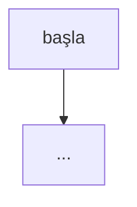

# Tasarım NNNN: <özellik adı>

- **Durum:** Taslak | İnsan onayı bekliyor | Onaylandı (YYYY-MM-DD, onaylayan)
- **Kilometre taşı:** M?
- **İlgili ADR'ler:** NNNN
- **Crate'ler:** `jarvis-...`

> Bu belge onaylanmadan test ve kod yazılmaz (Mimari §9 Katman 5).

## Amaç

Ne çözülüyor, neden şimdi?

## Kapsam dışı

Bu tasarımın bilerek yapmadığı şeyler.

## Tipler ve arayüzler

Genel tipler, trait'ler, fonksiyon imzaları (Rust kod bloğu). Hangi crate'te durdukları.

## Algoritma / durum makinesi

## Hata durumları

| Durum | Davranış | Olay / hata kodu |
| --- | --- | --- |

Sessiz geri dönüş yok (ADR 0010).

## Test planı

| Seviye | Test | Oracle |
| --- | --- | --- |
| L1 | ... | ... |

Her test önce `cargo xtask verify --expect-red <test>` ile kırmızı görülür.

## Yeni bağımlılıklar

`cargo xtask crate-info <ad>` çıktısı ve ADR bağlantısı. Yoksa "yok".

## Açık sorular
