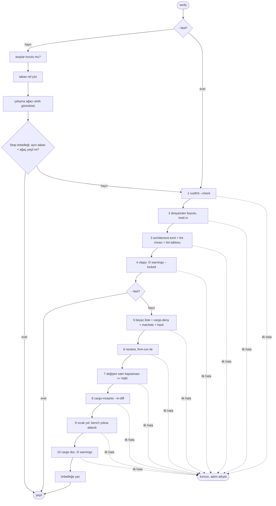
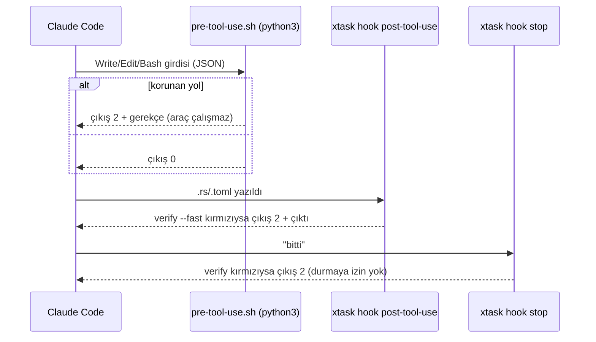

# Tasarım 0001: M-1 iskelet ve kalite kapıları

- **Durum:** İnsan onayı bekliyor (bu PR)
- **Kilometre taşı:** M-1
- **İlgili ADR'ler:** 0015, 0016, 0018, 0020, 0021
- **Crate'ler:** tüm crate iskeletleri, `xtask`

## Amaç

Kod yazılmaya başlamadan önce, kötü kodun derlenmesini, commit edilmesini ve "bitti"
sayılmasını mekanik olarak engelleyen altyapıyı kurmak (Mimari §9, §13 M-1).

## Kapsam dışı

- Herhangi bir ürün işlevi (M1+). Crate'ler yalnızca belgelenmiş boş iskelettir;
  `jarvisd` ve `jarvis` ikilileri `--version` dışında açıkça başarısız olur.
- `jarvis-fixture` (aracı M0 kararı), `e2e-real`, `release`, Gungraun kapısı (M3), RPM (M0 #11).
- Branch protection'ın kendisi: GitHub ayarıdır, `docs/runbooks/github.md`'de adım adım.

## Bileşenler

| Bileşen | Yer |
| --- | --- |
| Çalışma alanı, lint tablosu, release profili | `Cargo.toml` |
| Onaylı lint/profil kopyası | `xtask/src/baseline/workspace.toml` |
| Lint eşikleri, biçim, toolchain | `clippy.toml`, `rustfmt.toml`, `rust-toolchain.toml` |
| Katman sözleşmesi | `architecture.toml` |
| Tedarik zinciri | `deny.toml`, `supply-chain/allowlist.toml` |
| Kapı aracı | `xtask/` (`cargo xtask ...`, `.cargo/config.toml`) |
| Hook'lar | `.claude/settings.json`, `.claude/hooks/` |
| CI | `.github/workflows/ci.yml`, `.github/CODEOWNERS`, `.github/dependabot.yml` |

## `cargo xtask verify` akışı

## Hook akışı

## Hata durumları

| Durum | Davranış |
| --- | --- |
| Eksik cargo aracı | `verify` kurulum komutuyla kırmızı |
| Taban ref yok | `verify` kırmızı; `--base <ref>`/`JARVIS_BASE_REF`/`--base root` önerir |
| `Cargo.lock` güncel değil | clippy `--locked` kırmızı |
| `python3` yok / hook girdisi bozuk | PreToolUse engeller (fail-closed) |
| xtask derlenemiyor | Post/Stop hook'ları çıkış 2 ile engeller; PreToolUse etkilenmez |
| Bench hedefi eklenmiş | Gungraun kurulana kadar kırmızı |

## Test planı

| Seviye | Test | Oracle |
| --- | --- | --- |
| L1 | `xtask` birim testleri: boyut, mod.rs, mimari ihlali, lint mirası, lint tablosu, beyaz liste, diff ayrıştırma, lcov, kapsama eşiği, tarih, `--expect-red` yorumu, hook tetikleme | Bilinen girdiler |
| L5a | `jarvisd`/`jarvis` ikilileri gerçek süreç olarak: `--version` ve açık başarısızlık | Çıkış kodu + akışlar |
| M-1 kanıtı | `cargo xtask selftest`: 13 bozulma × ilgili kapı, kontrol kopyası yeşil; 14 hook senaryosu | Kapı sonucu, gerçek betik çıkış kodu |

## Yeni bağımlılıklar

`anyhow`, `serde`, `serde_json`, `toml` (yalnızca `xtask`) — ADR 0020.

## Açık sorular

1. Depo gizliliği (özel/açık) ve `main` dalının oluşturulması — `docs/runbooks/github.md`.
2. Hook'ların gerçek Claude Code kurulumunda exit 2 ile engellediği (M0 #12).
