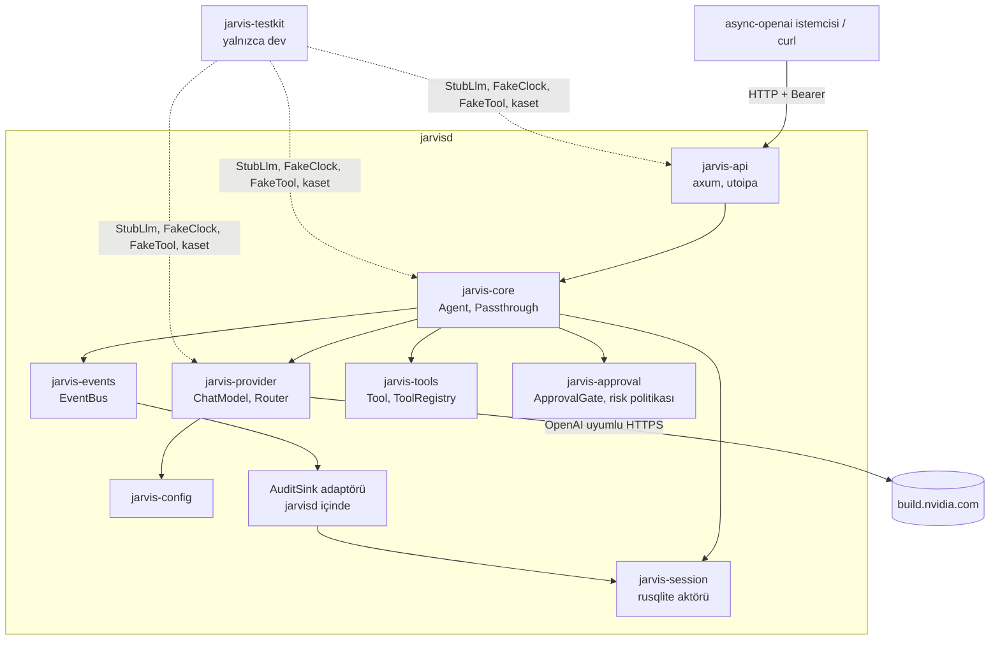

# Tasarım 0002: M1 genel bakış — çekirdek + API

- **Durum:** İnsan onayı bekliyor
- **Kilometre taşı:** M1
- **İlgili ADR'ler:** 0022–0031 (öneri), 0002, 0003, 0004, 0005, 0010, 0014
- **Alt tasarımlar:** 0003 types · 0004 config · 0005 events · 0006 provider · 0007 session ·
  0008 core (+ minimal tools/approval) · 0009 api · 0010 jarvisd · 0011 test altyapısı

> Bu belge ve alt tasarımlar onaylanmadan M1 testi/kodu yazılmaz (Mimari §9 Katman 5).

## Amaç

M1 "bitti" ölçütü (Mimari §13):

1. `async-openai` istemcisiyle API sözleşme testleri yeşil (L4).
2. Sahte araçlarla ajan senaryoları yeşil (L2).
3. NVIDIA ile gerçek bir sohbet (elle, kanıtı PR'da).
4. Smoke eval ve kaset altyapısı çalışıyor (L3, L6 smoke).

## Kapsam dışı (M2+)

Gerçek sistem araçları (süreç/dosya/kabuk), onay kuyruğu ve `/approvals` uçları, terminal
istemcisi, RPM, masaüstü, `vision` rolünün gerçek kullanımı, `/mcp`. M1'de onay gerektiren
her araç çağrısı **açıkça reddedilir** (`approval_denied`, ADR 0010) — sessizce çalıştırılmaz.

## Mimari (M1'de etkin parçalar)

## Alan modeli ile tel biçimi ayrıdır (ADR 0029)

Ajan kendi tipleriyle (`jarvis-types::Message`, `ToolCall`, `ToolSpec`) çalışır. OpenAI tel
biçimi yalnızca iki kenarda görünür: `jarvis-provider` (sağlayıcıya giden) ve `jarvis-api`
(istemciden gelen). Eşleme her iki kenarda L3/L4 testleriyle sınanır. Böylece `jarvis-core`
ne HTTP'ye ne de `async-openai`'a bağlıdır.

## Bağımlılık enjeksiyonu

Saat (`Clock`), model (`ChatModel`), araçlar (`Tool`), onay (`ApprovalGate`), depolama
(`SessionRepo`) ve denetim (`AuditSink`) trait arkasındadır; gerçek uygulamalar `jarvisd`'de
bağlanır, sahteleri `jarvis-testkit`'te durur. Sağlayıcı ve masaüstü sahteyle değiştirilebilir
(Mimari §10 L2).

## Uygulama sırası (her biri ayrı PR, her PR'da `verify` yeşil)

| # | PR | Bağımlı olduğu | Kanıt |
| --- | --- | --- | --- |
| 1 | Kapı yamaları (insan): allowlist + `architecture.toml` (`jarvis-testkit`) | — | `selftest` yeşil |
| 2 | `jarvis-types` | — | L1 + proptest (serde gidiş-dönüş) |
| 3 | `jarvis-config` | 2 | L1: geçerli/geçersiz örnek dosyalar |
| 4 | `jarvis-events` | 2 | L1/L2: sıra numarası, gecikme olayı, SSE çerçevesi |
| 5 | `jarvis-session` | 2 | L5a: gerçek SQLite, geçici dizin, migrasyon yedeği |
| 6 | `jarvis-testkit` (StubLlm, FakeClock, FakeTool) | 2 | L1 |
| 7 | `jarvis-provider` + kaset sunucusu | 2, 3, 6 | L2 (429/geri çekilme FakeClock ile), L3 kaset |
| 8 | `jarvis-tools` + `jarvis-approval` (minimal) | 2, 4 | L1 risk tabloları (proptest) |
| 9 | `jarvis-core` | 4–8 | L2 senaryoları |
| 10 | `jarvis-api` + `openapi.json` | 9 | L4 `async-openai` sözleşme testleri |
| 11 | `jarvisd` bağlama | hepsi | L5a süreç testi, `/healthz` |
| 12 | Smoke eval (10 görev, kaset) + NVIDIA canlı sohbet kanıtı | 11 | L6 smoke |

## Açık kararlar (bu PR'la kapanması önerilen)

| Karar | Öneri | ADR |
| --- | --- | --- |
| SQLite sürücüsü | `rusqlite` (bundled), tek yazar aktör iş parçacığı | 0024 |
| Kütüphane hata tipi | `thiserror` | 0022 |
| Token dosyası | Sabit dosya `0600`; `jarvisd --rotate-token` ile döndürme + yeniden başlatma | 0027 |
| Otomatik sağlayıcı değiştirme | Yok | 0030 |
| Zaman ve kimlik | `time` + `uuid` v7 | 0026 |

## Yeni bağımlılıklar

Tümü `cargo xtask crate-info` ile denetlendi (2026-10-09), hepsi eşikleri geçiyor; ayrıntı
ilgili ADR'lerde. Beyaz liste girişi için insan yaması:
`docs/runbooks/pending/0002-m1-allowlist.patch`.

| Alan | Crate'ler | ADR |
| --- | --- | --- |
| Hata | `thiserror` | 0022 |
| Async + log | `tokio`, `tokio-util`, `tokio-stream`, `futures-util`, `tracing`, `tracing-subscriber` | 0023 |
| SQLite | `rusqlite` | 0024 |
| HTTP/API | `axum`, `tower`, `utoipa`, `sd-notify` | 0025 |
| Kimlik/zaman | `uuid`, `time` | 0026 |
| Gizli değer | `secrecy`, `getrandom` | 0027 |
| Sağlayıcı | `async-openai` (`chat-completion`, `model`, `byot`, rustls) | 0004 |
| Test | `proptest`, `insta`, `tempfile`, `reqwest` (yalnızca testkit kayıt modu) | 0028 |

## Kapı değişiklikleri (insan yaması gerekir)

1. `supply-chain/allowlist.toml`: yukarıdaki girişler.
2. `architecture.toml`: `jarvis-testkit` (`production = false`); `dev_allowed` ile
   provider/core/api testlerinden erişim (ADR 0031).
3. M1 sonunda (PR 10): `openapi.json` kırıcı fark kapısı `xtask`'a (ayrı yama; tasarım 0009).

## Test planı (özet)

Her alt tasarımın test planı vardır. Kapsamlı eşleme:

| Ölçüt | Test | Seviye |
| --- | --- | --- |
| Sözleşme | `async-openai` ile `jarvis`, `planner` passthrough, akış, hata biçimi, yetkisiz istek | L4 |
| Ajan | metin yanıtı, araç → doğrulama → yanıt, onay gereken araç reddi, adım/süre sınırı, tekrar tespiti, iptal, `halt`, 429 geri çekilme, güvenilmeyen çıktı sarma | L2 |
| Kaset | kayıt yoksa kırmızı; `Authorization` kaydedilmez; tur başına eşleme | L3 |
| Gerçek süreç | `jarvisd` başlar, `/healthz` 200, `SIGTERM` temiz kapanış | L5a |
| Smoke | 10 görev, < 2 dk, kaset modunda | L6 |
