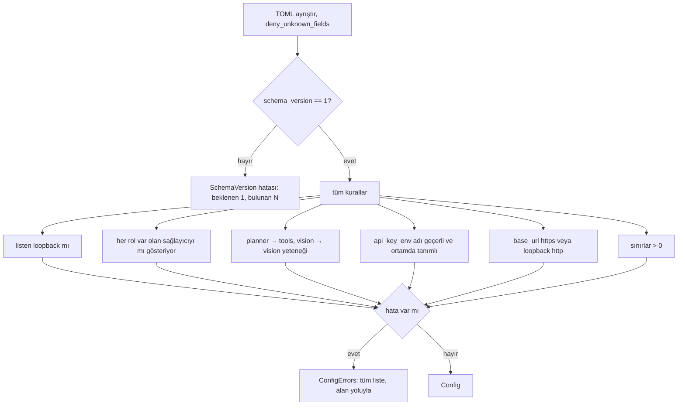

# Tasarım 0004: `jarvis-config`

- **Durum:** Onaylandı (2026-10-09, Yasin Akmaz)
- **Kilometre taşı:** M1 (PR 3)
- **İlgili ADR'ler:** 0002, 0027, 0030
- **Bağımlılıklar:** `toml`, `thiserror` (uygulamada; bkz. Uygulama notları)

## Amaç

`config.toml`'u yükler, **tamamen** doğrular ve geri kalan sisteme tipli, geçerli bir
`Config` verir. Geçersiz yapılandırma başlangıçta durur; koşu sırasında bozulmaz (Mimari §5, §8).

## Kapsam dışı

Ortam değişkenindeki anahtarın **değerini** okumak (provider yapar; config yalnızca değişken
adını ve varlığını denetler). Sağlayıcıya ağ bağlantısı (yetenekler bildirime dayanır).

## Dosya biçimi (şema sürümü 1)

```toml
schema_version = 1

[server]
listen = "127.0.0.1:7878"          # yalnızca loopback; 0.0.0.0 / ::  reddedilir

[limits]                            # varsayılanlar M1 ölçümüyle güncellenir
max_steps = 25
max_run_seconds = 600
repeat_threshold = 3                # aynı eylem + aynı sonuç ardışık tekrar sayısı

[providers.nvidia]
base_url = "https://integrate.api.nvidia.com/v1"
api_key_env = "NVIDIA_API_KEY"      # anahtar asla dosyada değil
model = "<araç çağrısı destekleyen model>"
capabilities = ["tools", "streaming"]   # "tools" | "vision" | "streaming"
requests_per_minute = 40
timeout_seconds = 60

[roles]
planner = "nvidia"
fast = "nvidia"
# vision = "..."                    # M1'de isteğe bağlı; atanırsa "vision" yeteneği şart
```

## Tipler

```rust
pub struct Config { pub server: Server, pub limits: Limits,
                    pub providers: BTreeMap<ProviderName, Provider>, pub roles: Roles }
pub struct Server { pub listen: SocketAddr }          // doğrulanmış loopback
pub struct Provider { pub base_url: Url /* String, https veya http://127.0.0.1 */,
                      pub api_key_env: EnvVarName, pub model: String,
                      pub capabilities: BTreeSet<Capability>,
                      pub requests_per_minute: NonZeroU32, pub timeout: Duration }
pub struct Roles { pub planner: ProviderName, pub fast: ProviderName,
                   pub vision: Option<ProviderName> }

pub fn load(path: &Path, env: &dyn EnvLookup) -> Result<Config, ConfigErrors>;
pub fn parse(text: &str, env: &dyn EnvLookup) -> Result<Config, ConfigErrors>; // saf

/// Uygulama kimliği ve XDG dizinleri (Mimari §8): prod `jarvis`, dev `jarvis-dev`.
pub enum Profile { Production, Development }
pub struct Paths { pub config: PathBuf, pub secrets: PathBuf, pub token: PathBuf,
                   pub database: PathBuf }
impl Paths { pub fn resolve(profile: Profile, env: &dyn EnvLookup) -> Result<Self, ConfigErrors>; }
```

`EnvLookup` trait'i ortamı enjekte eder; testler gerçek ortama dokunmaz.

## Doğrulama (hepsi toplanır, ilk hatada durulmaz)



## Hata durumları

| Durum | Hata (alan yolu + düzeltme önerisi) |
| --- | --- |
| Bilinmeyen alan | `providers.nvidia.modle: bilinmeyen alan (model mi?)` |
| Loopback dışı dinleme | `server.listen: 0.0.0.0 reddedildi; 127.0.0.1 kullanın` |
| Yetenek uyumsuzluğu | `roles.planner: 'x' sağlayıcısı 'tools' bildirmiyor` |
| Anahtar ortamda yok | `providers.nvidia.api_key_env: NVIDIA_API_KEY tanımlı değil (secrets.env)` |
| Şema sürümü farklı | `schema_version: 2 bu sürümde desteklenmiyor (1 bekleniyor)` |

## Test planı

| Seviye | Test | Oracle |
| --- | --- | --- |
| L1 | `tests/fixtures/config/*.toml`: her geçersiz örnek için beklenen hata listesi | Elle yazılmış `.expected` dosyası |
| L1 | Birden çok hata aynı anda raporlanır | Hata sayısı |
| L1 proptest | Rastgele IPv4/IPv6 adresleri: yalnızca loopback kabul | `IpAddr::is_loopback` |
| L1 | `Paths::resolve`: `XDG_*` var/yok, dev/prod ayrımı | Beklenen yollar |

## Uygulama notları (PR 3)

Onaylı tasarımı daraltan ya da netleştiren kararlar; hiçbiri bir kuralı gevşetmez.

- **Oracle dosyaları:** `insta` yerine her geçersiz örneğin yanında elle yazılmış bir
  `.expected` dosyası var. `insta`'nın "çıktıyı kabul et" akışı, beklenen değeri test edilen
  koddan türetmeye teşvik eder; düz dosya bağımlılık da eklemez. Her örneğin bir testi olduğu
  ayrıca denetlenir.
- **Ayrıştırma:** `serde` + `deny_unknown_fields` ilk hatada durduğu için belge önce
  `toml::Table`'a ayrıştırılır, sonra şemaya göre elle gezilir. Böylece bilinmeyen alanlar,
  tip hataları ve kurallar tek seferde, alan yoluyla raporlanır. Sıra dosya sırası değil
  şema sırasıdır: üst düzey bilinmeyen alanlar, `server`, `limits`, `providers` (ada göre),
  `roles`; her tabloda önce bilinmeyen alanlar.
- **Yazım önerisi:** bilinen bir alana Levenshtein uzaklığı ≤ 2 ise (`modle` → `model`).
- **Varsayılanlar:** `[server]` ve `[limits]` (ve alanları) isteğe bağlıdır; belgelenmiş
  varsayılanlar `Server::DEFAULT_LISTEN` ve `Limits::DEFAULT_*` sabitlerindedir.
  Sağlayıcı alanlarının hepsi zorunludur (hız sınırı ve zaman aşımı sağlayıcıya özgüdür).
- **Ek kurallar:** dinleme portu 0 olamaz (istemciler rastgele portu bulamaz). Tamsayılar
  `1..=u32::MAX`. Aynı yetenek iki kez yazılamaz. `api_key_env` tanımlı ama boşsa eksik sayılır.
- **`base_url`:** `url` crate'i eklenmedi; `BaseUrl` güvenlik açısından önemli kuralları
  denetler: `https://`, ya da yalnızca loopback (`127.0.0.0/8`, `::1`, `localhost`) için
  `http://`; boş sunucu adı, URL'de kimlik bilgisi (`kullanıcı:parola@`), sorgu/parça,
  geçersiz port ve boşluk reddedilir.
- **Geçersiz sağlayıcıya rol:** dosyada tanımlı ama kendi alanları geçersiz bir sağlayıcıyı
  gösteren rol için ek hata üretilmez (asıl hata sağlayıcıda raporlanmıştır).
- **XDG:** `XDG_CONFIG_HOME`/`XDG_DATA_HOME` boşsa tanımsız sayılır (XDG belirtimi). Göreli
  değer XDG'de "geçersiz, yok say" diye tanımlıdır; burada sessiz geri dönüş yerine **hata**dır.
  `HOME` yalnızca bir XDG değişkeni eksikse gerekir.
- **`jarvis-types` bağımlılığı:** M1 kapsamında config bu crate'ten bir tip kullanmadığı için
  eklenmedi (kullanılmayan bağımlılık `machete` kapısında kırmızıdır).
