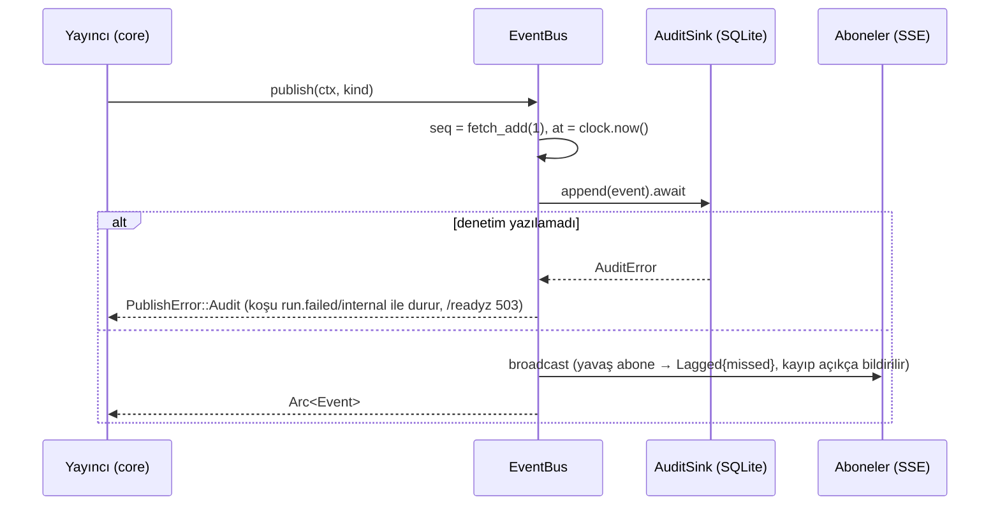

# Tasarım 0005: `jarvis-events`

- **Durum:** Onaylandı (2026-10-09, Yasin Akmaz)
- **Kilometre taşı:** M1 (PR 4)
- **İlgili ADR'ler:** 0010, 0023
- **Bağımlılıklar:** `jarvis-types`, `serde`, `serde_json`, `tokio` (sync), `thiserror`

## Amaç

Tüm koşu olaylarını tek yerden yayınlamak: canlı izleyicilere (SSE, Mimari §3) ve **kayıpsız**
denetim kaydına. Her olay `run_id`, `trace_id`, zaman damgası ve monoton sıra numarası taşır.

## Kapsam dışı

HTTP/SSE taşıması (`jarvis-api`), veritabanına yazma (`jarvis-session`; adaptör `jarvisd`'de).

## Tipler

```rust
pub struct Event {
    pub seq: EventSeq, pub at: Timestamp,
    pub run_id: Option<RunId>, pub trace_id: TraceId,
    pub kind: EventKind,
}
#[serde(tag = "type")]  // tel adları Mimari §3 tablosuyla aynı
pub enum EventKind {
    #[serde(rename = "run.started")]  RunStarted { session_id: Option<SessionId> },
    #[serde(rename = "run.step")]     RunStep { step: u32, phase: StepPhase, detail: String },
    #[serde(rename = "run.finished")] RunFinished { steps: u32 },
    #[serde(rename = "run.failed")]   RunFailed { code: ErrorCode, message: String },
    #[serde(rename = "tool.requested")] ToolRequested { call: ToolCallSummary, risk: RiskLevel },
    #[serde(rename = "tool.completed")] ToolCompleted { call_id: ToolCallId,
                                                         verification: Verification },
    #[serde(rename = "approval.requested")] ApprovalRequested { .. }, // M2
    #[serde(rename = "approval.resolved")]  ApprovalResolved { .. },  // M2
    #[serde(rename = "desktop.unavailable")] DesktopUnavailable { backend: String, reason: String },
    #[serde(rename = "halt")] Halt { cancelled_runs: u32 },
}

/// Denetim kaydı. Yazılamazsa yayın başarısız olur (kayıpsız).
pub trait AuditSink: Send + Sync {
    fn append(&self, event: &Event) -> BoxFuture<'_, Result<(), AuditError>>;
}

pub struct EventBus { /* broadcast::Sender<Arc<Event>>, AtomicU64, Arc<dyn AuditSink>, Clock */ }
impl EventBus {
    pub fn new(capacity: usize, audit: Arc<dyn AuditSink>, clock: Arc<dyn Clock>) -> Self;
    pub async fn publish(&self, ctx: EventContext, kind: EventKind)
        -> Result<Arc<Event>, PublishError>;
    pub fn subscribe(&self) -> Subscription;
}
pub enum Received { Event(Arc<Event>), Lagged { missed: u64 } }
impl Subscription { pub async fn recv(&mut self) -> Option<Received>; }

/// SSE çerçevesi (saf): `id: <seq>\nevent: <type>\ndata: <json>\n\n`
pub fn sse_frame(event: &Event) -> Result<String, serde_json::Error>;
```

## Algoritma



Denetim önce, yayın sonra: izleyicinin gördüğü her olay denetimde de vardır. Yavaş bir SSE
istemcisi yayıncıyı bloklamaz; kaçırdığı olay sayısını `Lagged` ile öğrenir (sessiz kayıp yok),
SSE'de `event: events.lagged` olarak iletilir. İstemci `Last-Event-ID` ile denetim kaydından
tamamlayabilir (M2'de `GET /events?since=` olarak).

## Hata durumları

| Durum | Davranış |
| --- | --- |
| Denetim yazımı başarısız | `publish` hata döner; çağıran koşuyu `internal` ile durdurur; `/readyz` 503 |
| Abone yavaş | `Lagged { missed }` |
| Abone yok | Normal (broadcast hata saymaz) |
| Gizli değer | Olay içerikleri tiplidir; serbest metin alanları (`detail`, `message`) `jarvis-types::redact` maskeleme fonksiyonundan geçer |

## Test planı

| Seviye | Test | Oracle |
| --- | --- | --- |
| L1 | `sse_frame` biçimi; çok satırlı veride her satır `data:` önekli | Elle yazılmış çerçeve |
| L1 | Tüm `EventKind` tel adları Mimari §3 tablosuyla aynı (insta) | Anı görüntüsü |
| L2 | Sıra numarası eşzamanlı yayında benzersiz ve artan | Sıralama özelliği |
| L2 | Kapasite 4, 10 olay, abone okumuyor → `Lagged { missed: 6 }` | Aritmetik |
| L2 | Sahte `AuditSink` hata verir → `publish` hata döner, abone olayı görmez | Abone kuyruğu boş |
