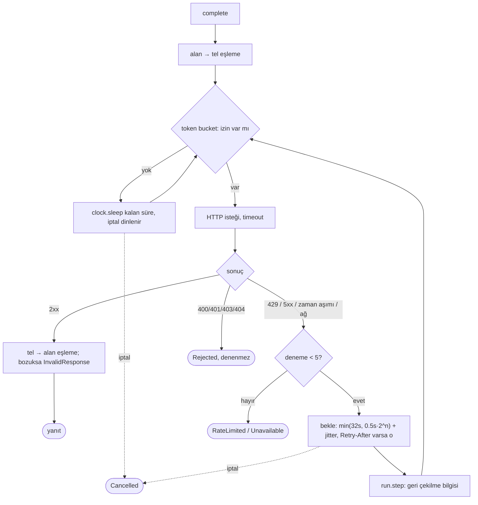

# Tasarım 0006: `jarvis-provider`

- **Durum:** Onaylandı (2026-10-09, Yasin Akmaz)
- **Kilometre taşı:** M1 (PR 7)
- **İlgili ADR'ler:** 0002, 0004, 0027, 0029, 0030
- **Bağımlılıklar:** `jarvis-types`, `jarvis-config`, `async-openai` (`chat-completion`, `model`,
  `byot`, varsayılan rustls), `secrecy`, `tokio`, `tokio-util`, `futures-util`, `tracing`,
  `serde_json`, `thiserror`

## Amaç

Rol adıyla (`planner`, `vision`, `fast`) OpenAI uyumlu sağlayıcılara ulaşmak: alan tipleri ↔
tel tipleri eşlemesi, sağlayıcı başına hız sınırı, yeniden denenebilir hatalarda üstel geri
çekilme, iptal. Barındırılan ↔ yerel geçiş yalnızca `base_url` (ADR 0002).

## Kapsam dışı

Otomatik sağlayıcı değiştirme (ADR 0030). Görüntü girdisi eşlemesi (M4). Maliyet hesabı.

## Tipler

```rust
pub enum RoleName { Planner, Vision, Fast }

pub struct ChatRequest { pub messages: Vec<Message>, pub tools: Vec<ToolSpec>,
                         pub max_tokens: Option<u32> }
pub struct ChatResponse { pub message: Message, pub finish: FinishReason,
                          pub usage: Option<Usage>, pub model: String }

/// Ajanın gördüğü tek arayüz. Gerçeği OpenAiModel, sahtesi testkit::StubLlm.
pub trait ChatModel: Send + Sync {
    fn complete(&self, request: ChatRequest, cancel: CancellationToken)
        -> BoxFuture<'_, Result<ChatResponse, ProviderError>>;
}

/// `/v1/chat/completions` passthrough için ham tel JSON'u (byot).
pub enum RawResponse { Json(serde_json::Value),
                       Stream(BoxStream<'static, Result<serde_json::Value, ProviderError>>) }
pub trait RawChat: Send + Sync {
    fn forward(&self, body: serde_json::Value, cancel: CancellationToken)
        -> BoxFuture<'_, Result<RawResponse, ProviderError>>;
}

pub struct Router { /* RoleName → Arc<Bound> (ChatModel + RawChat + bilgi) */ }
impl Router {
    pub fn from_config(config: &Config, env: &dyn SecretLookup, clock: Arc<dyn Clock>)
        -> Result<Self, ProviderError>;              // anahtar burada okunur, SecretString olur
    pub fn chat(&self, role: RoleName) -> Option<Arc<dyn ChatModel>>;
    pub fn raw(&self, role: RoleName) -> Option<Arc<dyn RawChat>>;
    pub fn describe(&self) -> Vec<ProviderInfo>;    // /providers için; anahtar yok
}

pub enum ProviderError {
    RateLimited { retry_after: Option<Duration> },  // 429, denemeler tükendi
    Unavailable { status: Option<u16>, message: String }, // 5xx/zaman aşımı/ağ, tükendi
    Rejected { status: u16, message: String },     // 400/401/403/404: denenmez
    InvalidResponse(String),                        // eşlenemeyen yanıt
    Cancelled,
}
```

## Algoritma: çağrı yolu



- Jitter deterministik değildir; testte `Clock` + enjekte edilen rastgele kaynak sabitlenir.
- Geri çekilme bildirimi: provider olay veriyolunu bilmez; `ChatModel`'e verilen
  `RetryObserver` geri çağrısıyla core `run.step` yayınlar.
- Araç çağrısı argümanları JSON metin olarak gelir; ayrıştırılamazsa `InvalidResponse` değil,
  ajana "geçersiz argüman" araç sonucu olarak döner (core'da; model kendini düzeltebilir).

## Gizli değerler

- Anahtar `SecretString`'de tutulur; `Debug`/`Display` maskelidir.
- `jarvis-types::redact(text, secrets)` (saf fonksiyon, tüm katmanlar kullanır) bilinen anahtar değerlerini ve `Bearer ...` desenlerini
  `***` ile değiştirir; hata mesajları ve olay metinleri bundan geçer.

## Kaset tekrarı (L3)

`jarvis-testkit::CassetteServer` yerel `127.0.0.1:0` üzerinde OpenAI ucu taklidi yapar; testte
sağlayıcının `base_url`'i ona yönelir — üretim kodunda kaset dalı yoktur. Ayrıntı: tasarım 0011.

## Hata durumları

| Durum | Davranış |
| --- | --- |
| 429, Retry-After | O kadar bekle; 5 denemede `RateLimited` |
| 401 | Hemen `Rejected`; mesaj anahtarı içermez |
| Yanıtta ne metin ne araç çağrısı | `InvalidResponse` |
| Rol atanmamış (`vision`) | `Router::chat` → `None`; çağıran `provider_unavailable` döner |
| İptal | Bekleme ve istek sırasında; `Cancelled` |

## Test planı

| Seviye | Test | Oracle |
| --- | --- | --- |
| L1 proptest | Alan → tel → alan eşleme gidiş-dönüşü (mesaj, araç çağrısı, araç sonucu) | Eşitlik |
| L1 | Token bucket: 40/dk, FakeClock ile 41. istek 1,5 sn bekler | Saat |
| L2 | Kaset: 429, 429, 200 → 2 bekleme (0,5 s, 1 s ± jitter=0), başarı | FakeClock kayıtları |
| L2 | 401 → tek istek, `Rejected`, anahtar hata metninde yok | İstek sayısı, metin taraması |
| L2 | Bekleme sırasında iptal → `Cancelled`, ek istek yok | İstek sayısı |
| L3 | Kaydedilmiş NVIDIA yanıtları (metin, araç çağrısı, akış) | Kaset |
| L1 | `redact` anahtarı ve `Bearer` desenini maskeler | Metin |

## Uygulama notları (PR 7; onay bekliyor)

Onaylı tasarımdan sapmalar ve netleştirmeler. **1, 2 ve 3 numaralı maddeler tasarım metniyle
çelişir veya bir şeyi eksik bırakır; onay gerektirir.**

1. **Kütüphanenin kendi yeniden denemesi kapatıldı (`middleware` özelliği).** `async-openai`
   0.42 varsayılan istemcisi 429/5xx'te kendi içinde, gerçek `tokio::time::sleep` ile yeniden
   dener. Bu, saat-enjekteli geri çekilme, `RetryObserver` bildirimi ve "sessiz geri dönüş yok"
   kuralıyla çelişir (bekleme gözlenemez, `FakeClock` ile sınanamaz). Çözüm:
   `with_http_service(ReqwestService::default())` ile yeniden deneme katmanı olmayan taşıma
   takıldı; deneme sayısı ve bekleme yalnızca `OpenAiModel`de. Bunun için kütüphanenin
   `middleware` özelliği açıldı (ADR 0004'e eklendi). Yeni **doğrudan** bağımlılık yoktur;
   `tower`/`reqwest` geçişlidir.
2. **`Retry-After` şimdilik yok sayılır.** Kütüphane hata yolunda yanıt başlıklarını
   iletmez (`ApiErrorResponse` yalnızca durum ve gövde taşır). Tasarımdaki "429 + Retry-After →
   o kadar bekle" davranışı yerine kendi geri çekilme (0,5 s · 2ⁿ) uygulanır;
   `ProviderError::RateLimited::retry_after` bu yüzden hep `None`. Test
   `a_retry_after_header_is_not_honoured_yet_the_own_backoff_applies` bunu belgeler. Çözüm için
   seçenekler (karar sizin): (a) `tower`'ı `jarvis-provider`'a doğrudan bağımlılık yapıp başlığı
   yakalayan özel bir servis yazmak (allowlist girdisi var, gerekçesi yalnızca `jarvis-api`
   için yazılmış); (b) kütüphane bu bilgiyi iletene kadar beklemek.
3. **JSON olmayan 4xx gövdesi `Rejected` değil `InvalidResponse` olur.** Kütüphane, hata gövdesi
   `{"error": {...}}` biçiminde değilse (ör. yanlış `base_url`te HTML 404) durum kodunu
   atar. Yeniden denenmez, mesaj gövdeyi (maskeli, 512 karaktere kısaltılmış) içerir.
4. **İmza:** `ChatModel::complete` ve `RawChat::forward` ek olarak `observer: &dyn
   RetryObserver` alır (tasarımın "ChatModel'e verilen RetryObserver" cümlesinin somut
   hali; trait nesne-güvenli kalır). Bildirim her beklemeden önce gelir:
   `RetryNotice { attempt, delay, reason }`.
5. **Ek `ProviderError` değişkenleri:** `InvalidRequest` (M4'e kadar görüntü girdisi, boş
   istek, nesne olmayan passthrough gövdesi; hiçbiri sessizce düşürülmez) ve `MissingKey`
   (`from_config`: anahtar ortam değişkeni tanımsız, boş ya da UTF-8 değil). `code()` →
   `ErrorCode` eşlemesi eklendi.
6. **`Router::from_config`:** `SecretLookup` yerine `jarvis_config::EnvLookup` (yeni trait
   gereksiz). `from_config_with_jitter` ek. Aynı sağlayıcıyı paylaşan roller **tek**
   `OpenAiModel`i (dolayısıyla tek hız sınırı kovasını) paylaşır; test eder.
7. **Hız sınırı:** GCRA biçimli kova (kapasite = dakikalık istek sayısı, aralık = 60/n sn).
   Yeniden denemeler de kovadan geçer. İptal edilen çağrı belirteç tüketmez.
8. **Jitter:** `Jitter` trait'i; `NoJitter` (test) ve `RandomJitter` (yalnızca std
   `RandomState`, yeni bağımlılık yok). Jitter en çok taban beklemenin %25'idir ve
   kaynak bunu aşsa bile kırpılır.
9. **`max_tokens`** gönderilir (`max_completion_tokens` değil): uyumlu sağlayıcıların çoğu
   yenisini bilmez.
10. **Yanıt eşleme:** `argüman` metni JSON değilse ham metin `Value::String` taşınır
    (çağrıyı reddedip modele "geçersiz argüman" dönmek `jarvis-core`'un işi); geçersiz araç
    adı/kimliği, `custom` araç, `finish_reason` yokluğu, boş `choices` → `InvalidResponse`
    (koşul düşer; model kendini düzeltemez — M2'de core ile gözden geçirilecek açık nokta).
    `refusal` metni içerik olarak görünür. Yalnızca ilk seçenek kullanılır.
11. **Passthrough akışı:** akış kurulana dek yeniden deneme vardır, sonra yoktur. Hata, iptal ya
    da istek zaman aşımı kadar sessizlik akışın **son öğesi** olan bir `Err` üretir; `[DONE]`
    iletilmez.
12. **Ortam sızıntısı:** kütüphane `OPENAI_ORG_ID`/`OPENAI_PROJECT_ID`'yi ortamdan okur ve
    başlık olarak gönderir; üçüncü taraf sağlayıcıya sızardı. İkisi boş atanır. Test oracle'ı
    zayıftır (CI'da bu değişkenler tanımsız): yalnızca başlık adlarının yokluğunu denetler.
13. **L3 kasetleri elle yazıldı** (NVIDIA biçimli: `tool_calls: []`, `stop_reason`,
    `chatcmpl-tool-…`, SSE). Canlı kayıt değildir; PR 12'de (NVIDIA anahtarıyla, yerelde)
    değiştirilecek. `tests/cassettes/README.md` bunu açıkça yazar.
14. **Sürüm sabit:** `async-openai =0.42.1` (ADR 0004'te denetlenen sürüm).
