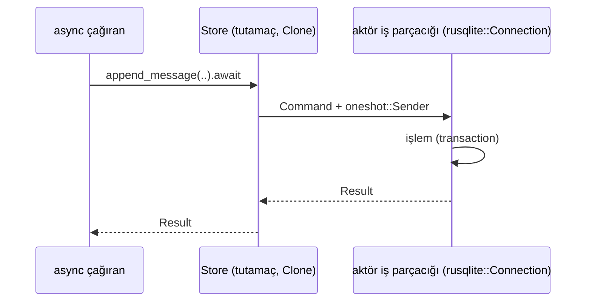
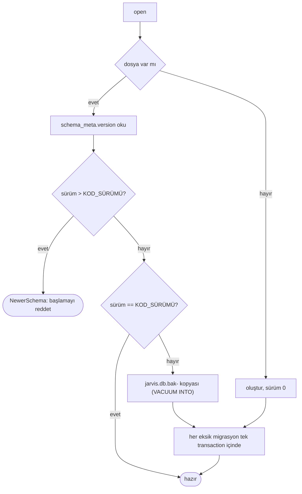

# Tasarım 0007: `jarvis-session`

- **Durum:** İnsan onayı bekliyor
- **Kilometre taşı:** M1 (PR 5)
- **İlgili ADR'ler:** 0005, 0024
- **Bağımlılıklar:** `jarvis-types`, `rusqlite` (`bundled`), `serde_json`, `tokio` (sync), `thiserror`

## Amaç

Oturumları, mesajları, koşuları ve denetim kaydını tek SQLite dosyasında saklamak; ileri yönlü,
yedekli migrasyon; kendisinden yeni şemayı reddetmek (Mimari §8).

## Kapsam dışı

Onay tablosu (M2 migrasyonu), notlar, saklama süresi temizliği (açık soru).

## Eşzamanlılık modeli

`rusqlite` eşzamanlı (blocking) olduğundan tüm erişim **tek bir aktör iş parçacığında**
(`std::thread`) yapılır; async taraf `mpsc` + `oneshot` ile konuşur. Tek yazar → SQLite kilit
çekişmesi yok; tokio çalışma zamanı bloklanmaz (Mimari §9 Katman 6 async kuralı).



## Tipler

```rust
pub struct Store { /* mpsc::Sender<Command> */ }
impl Store {
    /// Yedek + migrasyon + şema denetimi; başarısızsa daemon başlamaz.
    pub fn open(path: &Path, clock: Arc<dyn Clock>) -> Result<Self, StoreError>;
    pub async fn create_session(&self) -> Result<SessionId, StoreError>;
    pub async fn session(&self, id: SessionId) -> Result<Option<SessionSummary>, StoreError>;
    pub async fn list_sessions(&self, page: Page) -> Result<Vec<SessionSummary>, StoreError>;
    pub async fn delete_session(&self, id: SessionId) -> Result<bool, StoreError>;
    pub async fn messages(&self, id: SessionId) -> Result<Vec<Message>, StoreError>;
    pub async fn append_messages(&self, id: SessionId, run: RunId, msgs: Vec<Message>)
        -> Result<(), StoreError>;
    pub async fn record_run(&self, run: RunRecord) -> Result<(), StoreError>;
    pub async fn append_audit(&self, event: AuditRow) -> Result<(), StoreError>;
}
/// core'un gördüğü dar arayüz (sahtesi testkit'te).
pub trait SessionRepo: Send + Sync { /* messages, append_messages, create_session, record_run */ }
```

`AuditRow` jarvis-events'e bağımlı olmamak için düz alanlar taşır (`seq`, `at`, `run_id`,
`trace_id`, `kind`, `payload_json`); dönüşüm `jarvisd`'deki adaptörde.

## Şema v1

```sql
CREATE TABLE schema_meta (key TEXT PRIMARY KEY, value TEXT NOT NULL); -- 'version' = '1'
CREATE TABLE sessions (id TEXT PRIMARY KEY, created_at TEXT NOT NULL, updated_at TEXT NOT NULL);
CREATE TABLE messages (
  session_id TEXT NOT NULL REFERENCES sessions(id) ON DELETE CASCADE,
  ordinal INTEGER NOT NULL, run_id TEXT NOT NULL, body_json TEXT NOT NULL,
  PRIMARY KEY (session_id, ordinal));
CREATE TABLE runs (id TEXT PRIMARY KEY, session_id TEXT, trace_id TEXT NOT NULL,
  started_at TEXT NOT NULL, finished_at TEXT, outcome TEXT, agent_version TEXT NOT NULL);
CREATE TABLE audit_events (seq INTEGER PRIMARY KEY, at TEXT NOT NULL, run_id TEXT,
  trace_id TEXT NOT NULL, kind TEXT NOT NULL, payload_json TEXT NOT NULL);
CREATE TRIGGER audit_no_update BEFORE UPDATE ON audit_events
  BEGIN SELECT RAISE(ABORT, 'audit_events yalnızca eklemelidir'); END;
CREATE TRIGGER audit_no_delete BEFORE DELETE ON audit_events
  BEGIN SELECT RAISE(ABORT, 'audit_events yalnızca eklemelidir'); END;
```

Bağlantı ayarları: `journal_mode=WAL`, `foreign_keys=ON`, `synchronous=NORMAL`,
`busy_timeout=5000`. Dosya izinleri `0600`.

## Migrasyon



Migrasyonlar `migrations/NNNN_ad.sql` dosyalarıdır (`include_str!`), yalnızca ileri yönlüdür.

## Hata durumları

| Durum | Davranış |
| --- | --- |
| Daha yeni şema | `StoreError::NewerSchema { found, supported }`; `jarvisd` başlamaz |
| Yedek yazılamadı | Migrasyon yapılmaz, hata |
| Aktör iş parçacığı çöktü | Tüm çağrılar `StoreError::Closed`; `/readyz` 503 |
| Denetimde UPDATE/DELETE | SQLite `ABORT` (tetikleyici); hata |

## Test planı

| Seviye | Test | Oracle |
| --- | --- | --- |
| L5a | Boş dizinde aç → v1 şema; tekrar aç → migrasyon yok, yedek yok | Dosya sistemi, `schema_meta` |
| L5a | v0 (eski) dosya → `jarvis.db.bak-0` oluşur, içeriği eskiyle aynı | Bayt karşılaştırma |
| L5a | `version = 99` → `NewerSchema`, dosya değişmez | Dosya özeti |
| L5a | Denetim satırında UPDATE/DELETE reddedilir | SQLite hata kodu |
| L1 proptest | Mesaj ekle/oku gidiş-dönüşü, sıra korunur | Eşitlik |
| L5a | Dosya izinleri `0600` | `metadata().mode()` |
| L2 | 100 eşzamanlı ekleme, tokio çalışma zamanı bloklanmaz | Tamamlanma + sıra |

## Açık sorular

1. Saklama süresi: oturum/mesajlar için `retention_days` makul; denetim kaydı yalnızca
   eklemeli olduğu için silinmez mi, yoksa ayrı arşiv dosyasına mı taşınır? (Öneri: v1'de
   silinmez; boyut ölçülür.)
