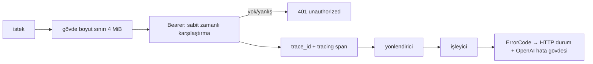

# Tasarım 0009: `jarvis-api`

- **Durum:** İnsan onayı bekliyor
- **Kilometre taşı:** M1 (PR 10)
- **İlgili ADR'ler:** 0002, 0005, 0012, 0025, 0027, 0029
- **Bağımlılıklar:** `jarvis-types`, `jarvis-core`, `axum`, `tower`, `utoipa`, `async-openai`
  (yalnızca `chat-completion-types`, `model-types` — HTTP istemcisi yok), `tokio`,
  `tokio-stream`, `futures-util`, `serde`, `serde_json`, `tracing`, `thiserror`

## Amaç

`127.0.0.1` üzerinde OpenAI uyumlu `/v1` ve Jarvis'e özgü uçlar (Mimari §4); Bearer kimlik
doğrulama; OpenAI hata biçimi; SSE; koddan üretilen `openapi.json`.

## Kapsam dışı (M1)

`/approvals` (M2), `/mcp` (isteğe bağlı, ileride), `GET /events?since=` (M2).

## Uçlar (M1)

| Uç | Davranış |
| --- | --- |
| `POST /v1/chat/completions` `model: "jarvis"` | Ajan koşusu. `x-jarvis-session` varsa oturum, yoksa geçici. Yanıt başlığı `x-jarvis-run-id`. `stream: true` → `chat.completion.chunk` SSE, son yanıt metni parça parça, `data: [DONE]` |
| `POST /v1/chat/completions` `model: "planner" \| "fast" \| "vision"` | Passthrough: gövde (model alanı sağlayıcının modeliyle değiştirilerek) ham iletilir; akış ham iletilir |
| `GET /v1/models` | `jarvis` + atanmış roller |
| `GET /events` | SSE (`jarvis-events::sse_frame`), 15 sn'de bir `: keep-alive` |
| `GET /sessions`, `GET /sessions/{id}`, `DELETE /sessions/{id}` | Oturum yönetimi |
| `GET /tools` | Araç envanteri (insta ile kilitli) |
| `GET /providers` | Rol → sağlayıcı, model, yetenek, durum; anahtar asla |
| `POST /halt` | `Agent::halt`; `{"cancelled_runs": n}` |
| `GET /healthz` | Süreç ayakta: her zaman 200 (kimlik doğrulamasız değil — tüm uçlar Bearer ister) |
| `GET /readyz` | DB aktörü + denetim yazımı + sağlayıcı yapılandırması tamam → 200, aksi 503 + neden |

`/healthz` ve `/readyz` de Bearer ister (Mimari §4: "tüm çağrılar"). `jarvis doctor` token'ı
dosyadan okur.

## Katman sırası

Bearer karşılaştırması: uzunluk + bayt bayt XOR birikimi (erken çıkışsız); ek crate yok.

## Hata eşlemesi

`{"error": {"message", "type", "param", "code"}}`

| `ErrorCode` | HTTP | `type` |
| --- | --- | --- |
| `invalid_request` | 400 | `invalid_request_error` |
| `unauthorized` | 401 | `authentication_error` |
| `not_found` | 404 | `invalid_request_error` |
| `approval_denied` | 403 | `jarvis_error` |
| `limit_reached` | 422 | `jarvis_error` |
| `halted` | 409 | `jarvis_error` |
| `desktop_unavailable` | 503 | `jarvis_error` |
| `provider_unavailable` | 502 | `api_error` |
| `provider_rejected` | 502 | `api_error` |
| `internal` | 500 | `api_error` |

Akış sırasında oluşan hata: SSE'de `data: {"error": {...}}` sonra `[DONE]`.

## OpenAPI ve sözleşme denetimi

- `utoipa` türevleri işleyicilerde; `openapi.json` depoda.
- L4 testi: üretilen belge == depodaki dosya; fark varsa test kırmızı ve dosyayı yeniden
  üretme komutunu söyler (`JARVIS_UPDATE_OPENAPI=1 cargo nextest run -p jarvis-api openapi`).
- Kırıcı fark kapısı (kaldırılan yol/yöntem/alan, zorunlu hâle gelen alan, değişen tip)
  ayrı bir `xtask` adımıdır; kapı dosyası olduğu için insan yaması olarak gelecek
  (`docs/runbooks/pending/`), PR 10 ile birlikte.

## Test planı (L4: `jarvisd` bileşenleri süreç içinde, `127.0.0.1:0`)

| Test | Oracle |
| --- | --- |
| `async-openai` `Client` + `base_url` → `model: "jarvis"` metin yanıtı | İstemcinin kendi tip ayrıştırması |
| Aynısı `stream: true` → parçalar birleşince tam metin, `[DONE]` | İstemci akışı |
| `x-jarvis-session` ile iki tur → ikinci turda geçmiş StubLlm'e gitti | StubLlm kaydı |
| Passthrough `planner` → kaset sunucusuna giden gövde = gelen gövde (model hariç) | Kaset kaydı |
| Token yok/yanlış → 401, OpenAI hata biçimi | `async-openai` hata tipi |
| `0.0.0.0` dinleme yapılandırması → başlamaz | config hatası |
| `POST /halt` koşu sırasında → koşu `halted`, yanıt 409 | Durum kodu + olay |
| `GET /events` → `run.started` ... `run.finished` sırası | SSE ayrıştırma (bağımsız ayrıştırıcı) |
| `GET /tools` anı görüntüsü | insta |
| `openapi.json` güncel | Dosya eşitliği |
| `/providers` yanıtında anahtar değeri yok | Metin taraması |
