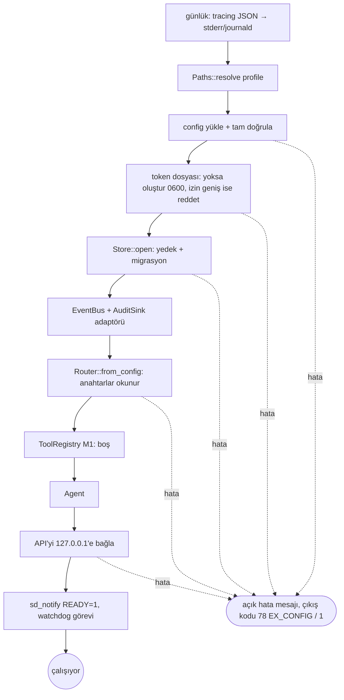

# Tasarım 0010: `jarvisd` bağlama

- **Durum:** İnsan onayı bekliyor
- **Kilometre taşı:** M1 (PR 11)
- **İlgili ADR'ler:** 0001, 0023, 0025, 0027
- **Bağımlılıklar:** tüm M1 crate'leri, `tokio` (rt-multi-thread, signal), `tracing-subscriber`
  (json), `sd-notify`, `getrandom`

## Amaç

Bileşenleri doğru sırayla kurmak, systemd'ye hazır olduğunu bildirmek, `SIGTERM`'de temiz
kapanmak (Mimari §3 süreç yaşam döngüsü).

## Komut satırı

```text
jarvisd [--profile prod|dev] [--config <yol>]   # varsayılan: prod, XDG yolu
jarvisd --rotate-token [--profile ...]            # yeni token yazar ve çıkar
jarvisd --version
```

## Başlangıç sırası



Masaüstü arka uçlarını yoklama adımı M3'te eklenir.

## Token (ADR 0027)

- İlk başlatmada `getrandom` ile 32 bayt → 64 karakter onaltılık; `0600` ile atomik yazım
  (geçici dosya + `rename`).
- Var olan dosyanın izni `0600` değilse başlamayı reddeder (sessizce düzeltmez).
- `--rotate-token`: yeni token yazar; çalışan daemon yeniden başlatılınca geçerli olur.

## Kapanış (`SIGTERM`/`SIGINT`)

1. API yeni bağlantı kabul etmez (graceful shutdown).
2. `Agent::halt()` → tüm koşular `halted`; `halt` olayı denetime yazılır.
3. Masaüstü kilidi bırakılır (M3).
4. Store aktörü kuyruğu boşaltıp kapanır; `sd_notify STOPPING=1`.
5. 10 sn içinde bitmezse çıkış kodu 1 ve günlükte neden.

## Watchdog

`WATCHDOG_USEC` varsa yarısı aralıkla `WATCHDOG=1`; yalnızca DB aktörü yanıt veriyorsa
(canlılık sorgusu) gönderilir — donmuş daemon systemd tarafından yeniden başlatılır.

## Test planı

| Seviye | Test | Oracle |
| --- | --- | --- |
| L5a | Geçici `HOME`/XDG ile başlat → token `0600` oluştu, `/healthz` 200 (token ile) | Dosya modu, HTTP |
| L5a | `SIGTERM` → 10 sn içinde çıkış kodu 0, denetimde `halt` olayı | Çıkış kodu, SQLite |
| L5a | Token dosyası `0644` → başlamaz, mesaj neden söyler | Çıkış kodu, stderr |
| L5a | `listen = "0.0.0.0:7878"` → çıkış kodu 78 | Çıkış kodu |
| L5a | `--rotate-token` → içerik değişti, mod `0600` | Dosya |
| L5a | `NOTIFY_SOCKET` sahte Unix soketi → `READY=1` alındı | Soket okuması |
